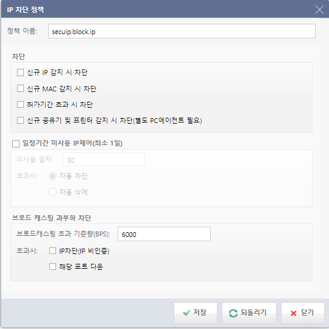
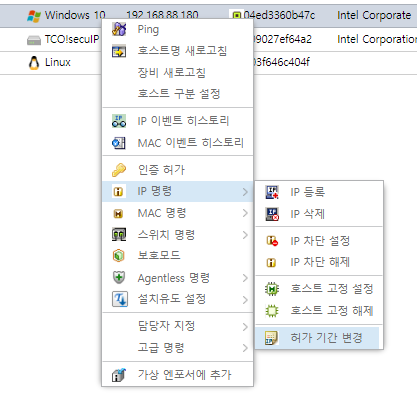
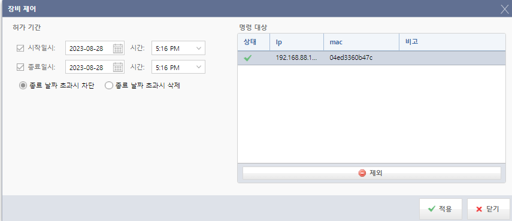
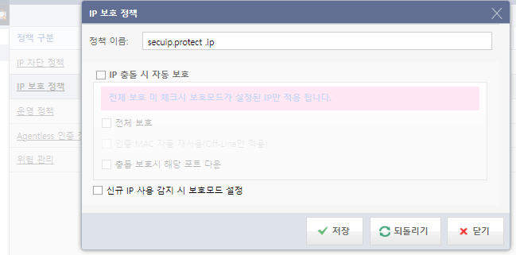
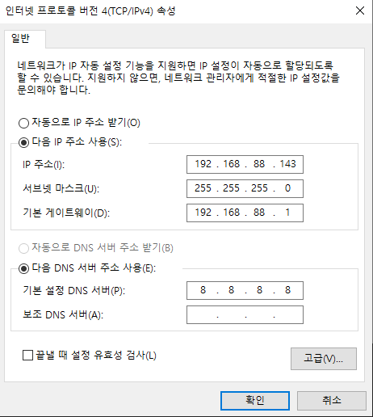
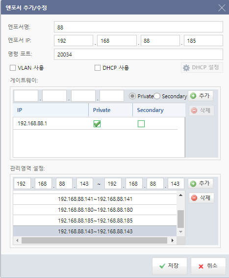
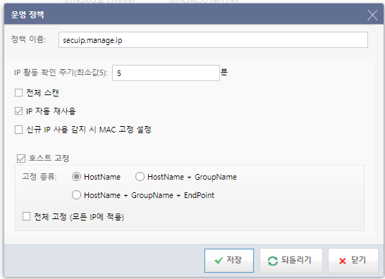
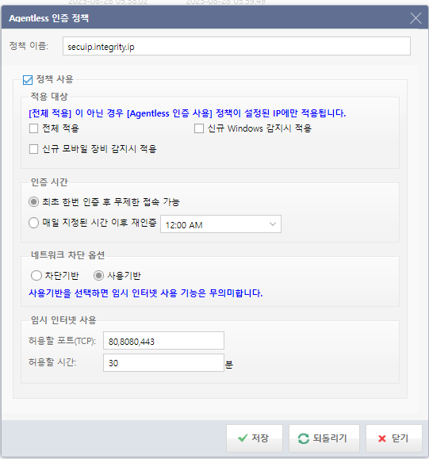

# IP 차단 정책

## 1. 차단 정책 설정 위치



```
웹 콘솔 - IP 관리 - 정책 - IP 차단 정책
```

```
신규 IP 수집 시, 미인증 상태로 등록된다.
차단 해제 방법 : IP 우클릭 -> 인증 허가
```

```
신규 IP 수집 시, MAC 차단 상태로 등록된다.
차단 해제 방법 : IP 우클릭 -> MAC 명령 -> MAC 차단 해제
```

```
ⓐ 차단 : IP 차단에 대한 설정을 할 수 있습니다.
- 신규 IP 감지 시 차단 : 신규 IP가 감지되면 네트워크를 차단합니다.
- 신규 MAC 감지 시 차단 : 신규 MAC이 감지되면 네트워크를 차단합니다.
- 허가기간 초과 시 차단 : IP의 허가기간이 초과되면 네트워크를 차단합니다.
- 신규 공유기 및 프린터 감지 시 차단 : 신규 공유기 및 프린터가 감지되면 네트워
크를 차단합니다. 
 (※ 별도의 PC에이전트가 필요한 기능입니다.)
ⓑ 일정기간 미사용 IP제어(최소 1일) : 지정한 기간 동안 사용하지 않은 IP에 대해 자동
차단 / 자동 삭제 설정을 합니다.
ⓒ 브로드캐스팅 과부하 차단 : 지정한 브로드캐스팅 기준량을 초과한 IP에 대해 IP 
차단 / 해당 포트 다운 설정을 합니다.
```


---

## 2. 허가 기간 초과 시 차단




```
허가 기간 초과 시 차단 정책을 적용,
IP 우클릭 -> IP 명령 -> 허가 기간 변경 -> 종료 일시 체크
종료 날짜 초과 시 차단/삭제 선택
차단 해제 방법 : IP 우클릭 -> 인증 허가
```

---

# IP 보호 정책

## 1. 보호 정책 설정 위치



```
웹 콘솔 - IP 관리 - 정책 - IP 보호 정책
```

```
ⓐ IP 충돌 시 자동 보호 : IP가 충돌할 경우 IP를 보호하도록 설정할 수 있습니다.
- 전체 보호 : 전체 보호를 설정하지 않은 경우 보호 모드가 설정된 IP만 적용됩니
다.
- 인증 MAC 자동 재 사용 : 인증 MAC에 한해서 IP를 자동으로 재 사용하도록 합
니다.
- 충돌 보호 시 해당 포트 다운 : IP 충돌 시 새로 들어온 장비의 포트를 다운 시킵
니다.
ⓑ 등록 IP 사용 감지 시 보호 모드 설정 : 등록 된 IP가 감지되면 보호 모드가 설정되도
록 합니다.
```

---

## 2. 신규 IP 사용 감지 시 보호 모드 설정



```
.143 대역으로 임의로 세팅하였다.
```




```
IP 보호 정책에서 `신규 IP 사용 감지 시 보호모드 설정`
엔포서에 .143 을 추가한다.

=> 기존에 등록된 관리 영역에 새롭게 IP가 등록될 시, 자동으로 보호 모드 적용
```


```
.143 IP 정보를 받아올 시 보호 모드 자동 적용됨을 확인할 수 있다.
```

# 운영 정책



```
ⓐ IP 활동 확인 주기 : IP를 스캔 주기를 설정합니다. (최소 5분)
ⓑ 전체 스캔 : 영역 내에 있는 IP를 전체 스캔 합니다.
ⓒ IP 자동 재사용 : 네트워크상에 접속되어 있는 클라이언트 PC 들 중에 Off-Line인 PC 
들의 IP를 회수하지 않고 재 접속 시 MAC 정보와 일치한 PC에 같은 IP를 다시 할당합니
다.
ⓓ 등록 IP 사용 감지 시 MAC 고정 설정 : 등록된 IP가 감지되면 MAC 고정을 설정하여
다른 장비가 해당 IP를 사용하지 못하도록 합니다.
ⓔ 호스트명 고정 : 호스트명 고정 설정 시 호스트명만 고정할 것인지 호스트명과 그룹명
을 고정할 것인지에 대한 설정을 합니다. 전체 고정으로 설정할 경우 모든 IP에 적용됩니
다.
```

# Agentless 인증 정책



```
ⓐ 적용 대상 : 정책 적용 대상을 선택 합니다.
ⓑ 인증 시간
① 로그인한 사용자에 대하여 최초 한번 인증하면 무제한으로 접속이 가능한 옵션입니다.
② 지정된 시간이 되면 사용자 인증을 다시 하는 옵션입니다.
ⓒ 네트워크 차단 옵션 : 차단 옵션을 차단 기반 또는 사용기반으로 설정할 수 있습니다.
※ 사용 기반으로 설정하면 임시 인터넷 사용 기능이 무의미합니다.
ⓓ 임시 인터넷 사용 : 계정이 없는 사용자가 임시로 인터넷만 사용할 수 있도록 설정합
니다.
- 허용할 포트 : 임시 인터넷 사용 시 허용 할 네트워크(IP, Port)를 설정합니다.
- 허용할 시간 : 임시 인터넷 사용 시 허용 할 시간을 설정합니다.
```

