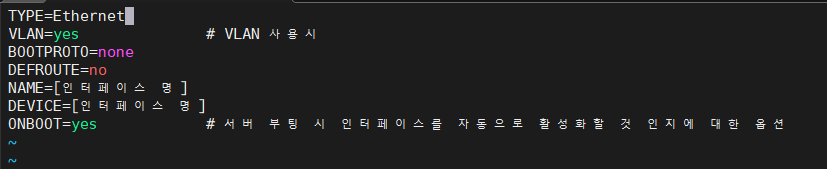
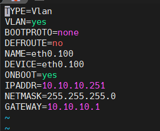
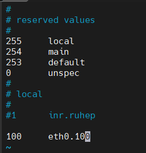
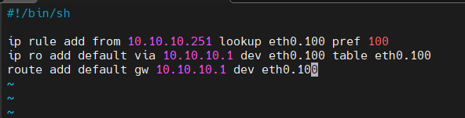
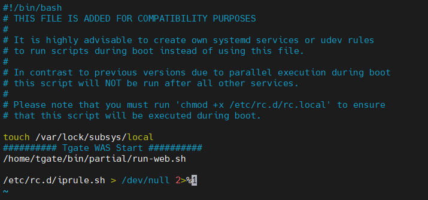

# VLAN 설정 가이드 

## 1. 인터페이스 파일 설정



```
cd /etc/sysconfig/network-scripts/
ls
인터페이스명 확인
vim ifcfg-[인터페이스 명]
!
TYPE=Ethernet
VLAN=yes              # VLAN 사용시
BOOTPROTO=none
DEFROUTE=no
NAME=[인터페이스 명]
DEVICE=[인터페이스 명]
ONBOOT=yes            # 서버 부팅 시 인터페이스를 자동으로 활성화할 것 인지에 대한 옵션
!

```

---


## 2. 인터페이스 파일을 VLAN-ID으로 복사



```
cp -p ifcfg-eth0 ifcfg-eth0.100
vim ens100.10
!
TYPE=Vlan
VLAN=yes
BOOTPROTO=none 
DEFROUTE=no
NAME=eth0.100
DEVICE=eth0.100
ONBOOT=yes 
IPADDR=10.10.10.251
NETMASK=255.255.255.0
GATEWAY=10.10.10.1 
!
```

---

## 3. VLAN 인터페이스 활성화



```
ifup eth0.100
vim /etc/iproute2/rt_tables
!
100 eth0.100  # [등록숫자(임의)] [인터페이스명]
!
```

---

## 4. 라우팅 테이블 추가


```
vim /etc/rc.d/iprule.sh
!
#!/bin/sh

ip rule add from [인터페이스 IP] lookup [인터페이스명] pref [rt_tables 등록 숫자]
ip ro add default via [게이트웨이 IP] dev [인터페이스명] table [인터페이스명]
route add default gw [게이트웨이 IP] dev [인터페이스명]
!
```

```
ex)
ip rule add from 10.10.10.251 lookup eth0.100 pref 100
ip ro add default via 10.10.10.1 dev eth0.100 table eth0.100
route add default gw 10.10.10.1 dev eth0.100
```



```
chmod 755 iprule.sh
./iprule.sh
vim /etc/rc.d/rc.local
!
파일 제일 아래에 /etc/rc.d/iprule.sh > /dev/null 2>&1 구문 추가
!
chmod 755 rc.local
chkconfig rc-local on
ifconfig
route -n
ping -l eth0.100 10.10.10.1 // verify
```


