# tgate 4.0 콘솔 사용 가이드

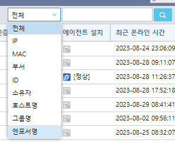

```
IP명, 엔포서명 등으로 검색을 할 수 있다.
```

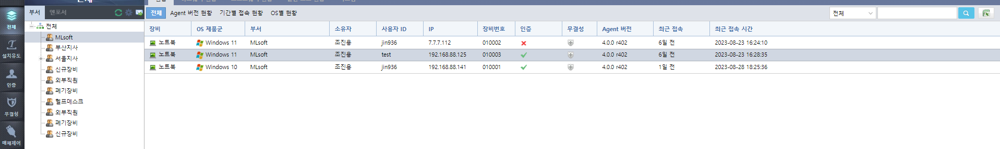

```
에이전트가 설치되어 있는 단말의 현황 및 인증과 무결성 상태를 보여준다.
```


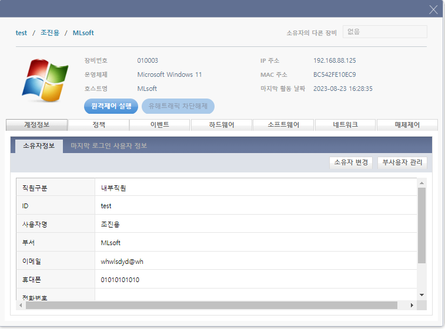

```
수집된 장비를 더블클릭하면 다양한 정보 등을 확인할 수 있다.
ⓐ 프로필 정보 : 해당 장비의 정보(장비번호, IP 주소, 운영체제, MAC 주소, 호스트명, 마
지막 접속 활동 날짜)등을 확인할 수 있습니다.
ⓑ 소유자의 다른 장비 : 해당 장비의 소유자가 소유한 다른 장비를 확인할 수 있습니다.
ⓒ 명령 : 해당 장비에 명령을 실행합니다.
- 원격제어 실행 : 관리자가 해당 장비에 원격 제어를 실행하여 원격으로 PC를
제어할 수 있습니다. (해당 사용자가 원격 수락 버튼을 눌러야 진행됩니다.)
- 유해 트래픽 차단해제 : 유해 트래픽 차단 정책에 의해 차단된 장비의 차단을
해제 시킵니다.
ⓓ 계정정보 : 해당 장비 소유자의 정보와 마지막 사용 정보를 볼 수 있습니다.
ⓔ 정책 : 해당 장비의 정책을 설정할 수 있습니다.
ⓕ 이벤트 : 해당 장비의 이벤트를 종류, 기간, 검색어 별로 필터링 하여 볼 수 있습니다.
ⓖ 하드웨어 : 해당 장비에 설치된 하드웨어 정보, 매체 제어 항목을 볼 수 있습니다.
ⓗ 소프트웨어 : 해당 장비에 설치된 소프트웨어 정보를 볼 수 있습니다.
※ ⓖ, ⓗ 는 하드웨어 수집 정책 이나 소프트웨어 수집 정책을 사용하지 않으면 항
목을 볼 수 없습니다.
ⓘ 네트워크 : 해당 장비의 네트워크 정보를 볼 수 있습니다.
ⓙ 매체제어 : 해당 장비의 매체제어 설정을 확인 할 수 있습니다.
ⓚ ZTS : 해당 장비가 접속 가능한 앱 서버 정보를 확인할 수 있습니다.
ⓛ 출력 : 선택한 컬럼 정보를 출력하여 볼 수 있습니다.
```

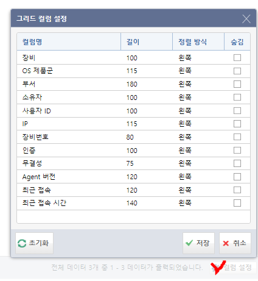

```
그리드 컬럼 설정으로 커스텀 사용 가능하다.
```

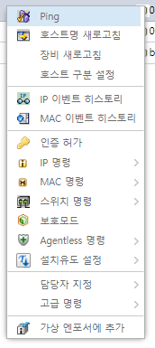

```
- Ping : 핑 결과를 얻기 위해서는 대상 호스트가 Ping에 대한 방화벽 설정이 되어있지 않아야 한다.
- 호스트명/장비 새로 고침 : 선택된 IP에 대해 '호스트명'과 '그룹 명' 정보를 조회한다.
- 호스트 구분 설정 : 서버, PC, NW장비, 기타로 호스트 구분 설정을 할 수 있다.
- IP 이벤트 히스토리 : 해당 IP의 이벤트 히스토리를 조회한다.
- MAC 이벤트 히스토리 : 해당 MAC의 이벤트 히스토리를 조회한다.
- 인증허가 : 해당 IP의 네트워크 사용을 허가한다.
- IP 등록/삭제 : IP 를 등록하거나 삭제 할 수 있습니다.
- IP 차단/해제 : 해당 IP 의 네트워크 사용을 제한할 수 있습니다.
- 호스트명 고정 : 호스트명이 일치 하지 않는 사용자에 대해서 IP 사용을 통제 할수 있습니다.
- 허가 기간 변경 : IP 를 일정 기간 동안만 사용하도록 사용 시간을 제한할 수 있습니다.
```

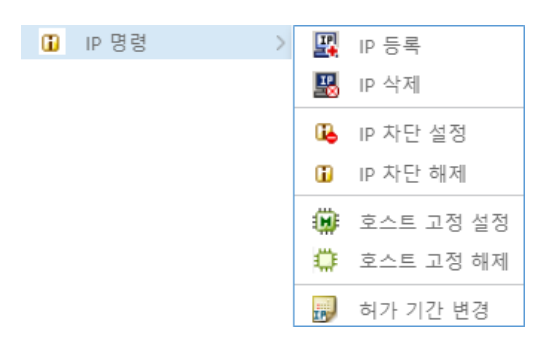

```
- IP 등록/삭제 : IP 를 등록하거나 삭제 할 수 있습니다.
- IP 차단/해제 : 해당 IP 의 네트워크 사용을 제한할 수 있습니다.
- 호스트명 고정 : 호스트명이 일치 하지 않는 사용자에 대해서 IP 사용을 통제 할
수 있습니다.
- 허가 기간 변경 : IP 를 일정 기간 동안만 사용하도록 사용 시간을 제한할 수
있습니다.
```

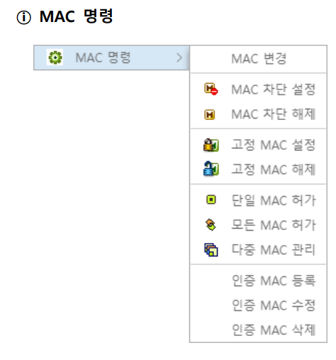

```
- MAC 차단 : 해당 MAC 의 네트워크 사용을 제한할 수 있습니다.
- MAC 고정 : MAC 고정 설정을 통해서 MAC 이 일치 하지 않는 사용자에 대해서
네트워크 사용을 통제 할 수 있습니다.
- 모든 MAC 허가 : 특정 IP 에 대해 모든 MAC 을 수용 할 수 있게 설정할 수
있습니다. IP 가 할당되어 하나의 IP 를 여러 대의 단말이 돌아가면서 사용할 수 있게합니다. 회의실 등 여러 컴퓨터(MAC)가 돌아가면서 한 IP 를 사용하는 경우 MAC 이 빈번하게 변경되어 인증을 그때마다 해줘야 컴퓨터를 사용할 수 있습니다. 이러한 경우 특정 IP 에게 재 사용을 설정하면 쉽게 사용할 수 있습니다.
- 단일 MAC 허가 : 단일 MAC 허가를 할 경우 해당 IP 는 현재 IP 목록에 등록된
단말(MAC)만 사용할 수 있습니다.
- 다중 MAC 관리 : 등록 된 여러 MAC 에 대해서만 IP 를 사용할 수 있도록 합니다.
- 인증 MAC 설정 : 인증 MAC 등록을 통해서 신규 MAC 차단 정책 적용 시 IP 사용이
차단 되는 것을 방지 할 수 있습니다.(모든 네트워크 대역 적용)
- [인증 MAC 설정] 참조
```

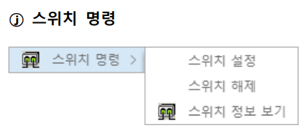

``````
- 스위치 설정 : 해당 IP 를 스위치로 등록합니다.(*스위치 명이 일치해야 합니다.)
- 스위치 정보 보기 : 스위치의 포트 정보를 확인할 수 있습니다
``````


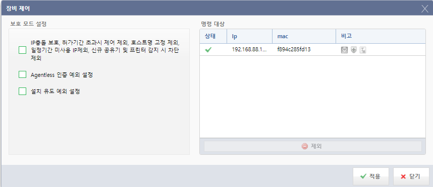

``````
- 보호모드 설정 : 정책(IP 충돌 보호, 허가기간 초과시 제어, 호스트명 고정, 일정기간
미사용 IP, 신규 공유기 및 프린터 감지 시 차단)으로부터 해당 I 를 보호하거나,
Agentless / 설치유도 예외 설정을 할 수 있습니다.
``````

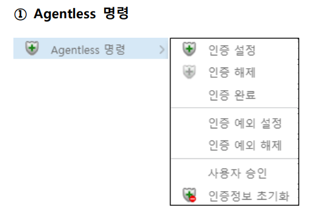

``````
- 인증 설정 : 해당 IP 에 Agentless 무결성 검사를 설정합니다.
- 인증 해제 : 해당 IP 에 Agentless 무결성 검사 설정을 해제합니다.  
              미 인증상태에서는 해제할 수 없습니다.
- 인증 예외 설정 / 해제 : 해당 IP 에 Agentless 무결성 검사를 예외처리 합니다.
- 검사 완료 : 관리자 권한으로 미 인증 상태의 IP 를 인증 상태로 설정합니다. 
- 사용자 승인 : 승인 요청 중인 IP 를 승인합니다.
- 인증정보 초기화 : 검사 완료 상태의 IP 를 미 인증 상태로 만듭니다.
``````

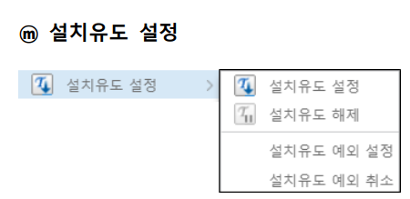

``````
- 설치유도 설정/해제 : 선택한 IP 에 에이전트가 설치가 안되었다면 설치 페이지로
이동하도록 설정합니다.
- 설치유도 예외 설정/취소 : 선택한 IP 는 에이전트 설치유도 예외처리 합니다.
``````

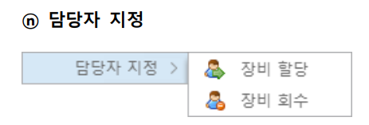
``````
- 장비 할당 : 선택한 장비에 담당자를 지정할 수 있습니다.
- 장비 회수 : 선택한 장비의 담당자로부터 장비를 회수할 수 있습니다.
``````
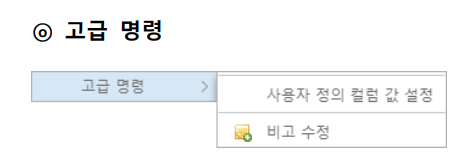

``````
- 사용자 정의 컬럼 값 설정 : 사용자가 정의한 컬럼 내용을 설정할 수 있습니다.
- 비고 수정 : 비고 값을 수정 할 수 있습니다.
``````


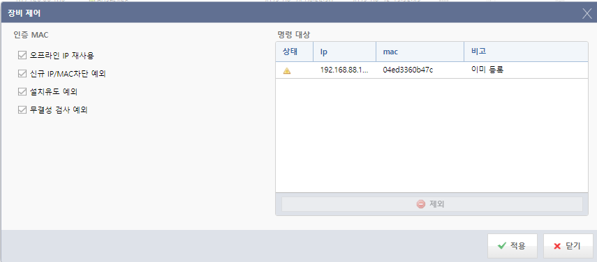

````
# 인증MAC 설정 방법

- 인증MAC : 인증 MAC 등록을 통해서 신규 MAC 차단 정책 적용 시 IP 사용이
차단 되는 것을 방지 할 수 있습니다.(모든 네트워크 대역 적용)

ⓐ 오프라인 IP 재사용 : 오프라인 상태의 IP를 사용할 수 있게 합니다.
ⓑ 신규 IP/MAC 차단 예외 : 신규 IP/MAC 차단 정책에서 예외 됩니다.
ⓒ 설치유도 예외 : 설치유도 정책에서 예외 됩니다.
ⓓ 무결성 검사 예외 : 무결성 검사 정책에서 예외 됩니다.
````

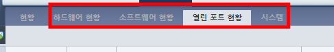

``````
H/W, S/W, 열린 포트 현황, 시스템의 현황을 확인할 수 있다.

시스템에서는 서버/엔포서 IP, CPU 사용량, 메모리 사용량, 디스크 사용량 등을 확인할 수 있다.
``````

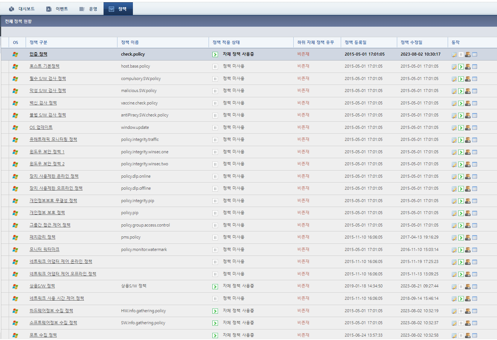

``````
전체 정책 현황을 확인할 수 있다.
``````

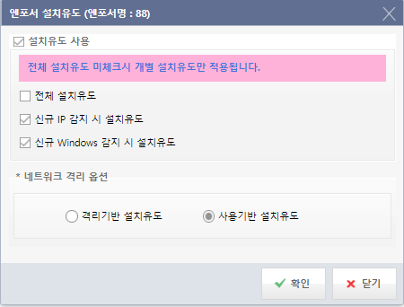

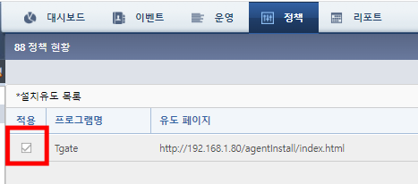

``````
설치유도 사용 체크, 정책에서도 정책 체크 해야 설치유도가 가능하다.
전체 설치유도란은 개별적으로 설정할 수 있는 체크 사항이다.
``````

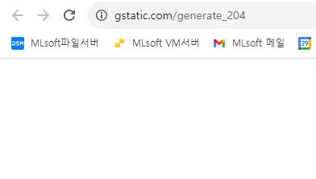

``````
에이전트 설치유도를 걸면 해당 페이지처럼 설치유도 페이지로 유도된다.
주의할점은 *인증MAC 설정이 되어있을 경우에 예외처리 되므로 설치 유도가 안된다.
``````

# 인증

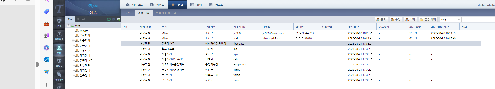

``````
인증 - 계정 현황 관련하여 명령을 수행하고 조직/부서 별 계정 상세 정보를 확인할 수 있다.
``````

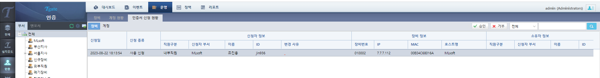

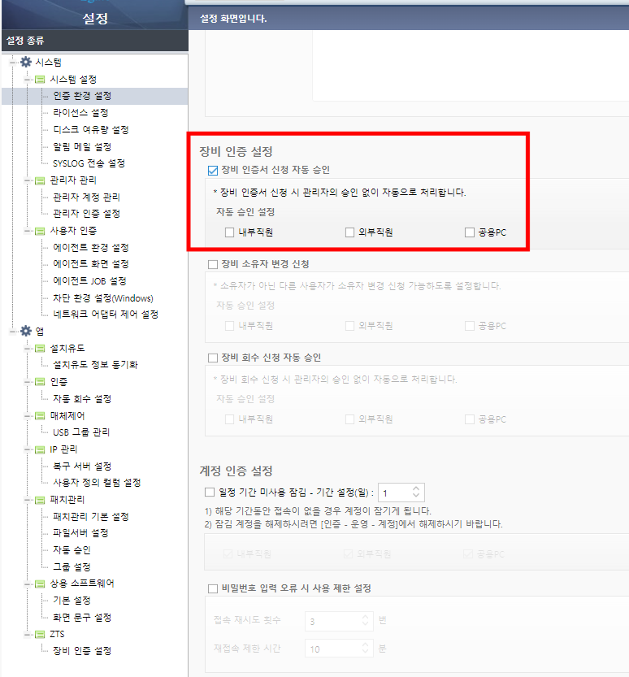

``````
ⓐ 장비/계정
- 사용자가 신청한 장비 또는 계정을 볼 수 있습니다.
ⓑ 승인/거부
- Agent 초기 설치 상태나 인증서 폐기 상태일 때 관리자가 장비 인증서 승인 신청
을 승인/거부할 수 있습니다.
- Agent에서 소유자 이전 신청을 하면 관리자가 확인 후 승인/거부할 수 있습니다.
※ [설정 – 인증 환경 설정 – 장비 인증서 / 소유자 이전 신청 자동 승인]정책을 사용
할 경우 별도의 관리자 승인 절차 없이 자동으로 인증서 승인이 이루어 집니다.
- [6.1.1.1 인증 환경 설정] 참조
``````


## 인증 정책

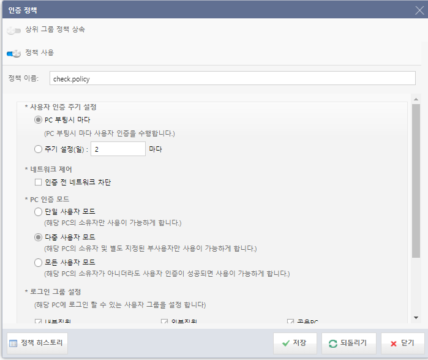

``````
- 사용자 인증 관련 정책을 할 수 있다.
- 네트워크로 접근하는 장비를 제어하기 위해 사용자 및 장비에 대한 인증 정책을 설정한다.
``````

``````
ⓐ 사용자 인증 주기 설정 : 사용자 인증(로그인) 주기를 설정합니다.
- 사용자 인증(로그인)을 pc부팅시마다 수행합니다.
- 사용자 인증(로그인)을 관리자가 설정한 일수마다 수행합니다.
ⓑ 네트워크 제어 : 인증(로그인)이 되지 않은 경우 네트워크를 차단 할 지를 설정
합니다.
ⓒ PC 인증 모드 : Agent 모드를 설정 합니다.
- 단일 사용자 모드: 해당 PC의 소유자만 사용이 가능합니다.
- 다중 사용자 모드: 해당 PC의 소유자 및 별도 지정된 부 사용자만 사용이
가능합니다.
- 모든 사용자 모드: 해당 PC 의 소유자가 아니더라도 사용자 인증이 성공하면
사용이 가능합니다.
``````

# 무결성

## 호스트 기본정책

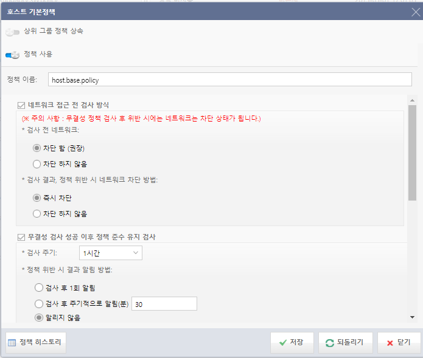

``````
ⓐ 정책 사용 : 무결성 검사 정책 사용 유무를 설정합니다.
ⓑ 네트워크 접근 전 검사 방식
- 차단 함(권장): 무결성 검사 진행 중 네트워크 차단 기반에서 검사를 합니다.
- 차단 하지 않음: 무결성 검사 진행 중 네트워크 차단하지 않은 상태 에서 검사를 합
니다.
ⓒ 무결성 검사 성공 이후 정책 준수 유지 검사
- 검사 주기 : PC 무결성 검사 주기를 지정합니다. 30분 단위로 선택 가능합니다.
- 정책 위반 시 결과 알림 방법 : 정책 위반 시 에이전트로 결과 알림 방법을 지정
합니다.
- 정책 위반 시 네트워크 차단 방법 : 무결성 정책 위반 시 네트워크의 차단 방법
을 지정 합니다.
ⓓ 자리 비울 시 에이전트 동작 설정
- 자리 비움 시간 : 에이전트 사용자가 일정 시간 동안 아무런 동작을 하지 않으면
자리 비움으로 간주합니다. (10분 단위로 설정 가능합니다. 기본값은 60분입니다.)
- 에이전트 동작 : 에이전트 사용자가 자리 비움 시의 에이전트 동작을 설정합니다.
``````

## 필수 S/W 검사 정책

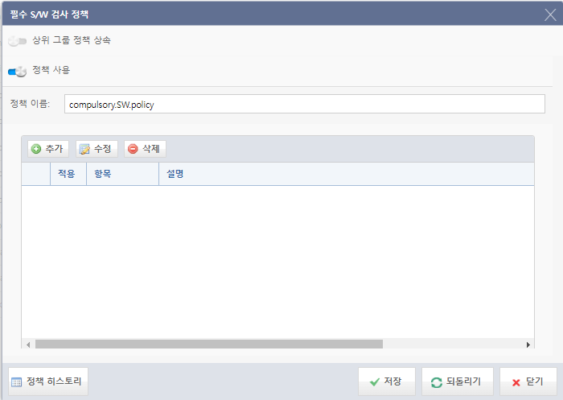

``````
- 네트워크를 사용하기 위해서 반드시 설치해야 할 S/W를 설정합니다. 필수 S/W가 설
치되어 있다면 무결성 검사가 ‘성공’하게 되어 정상적으로 네트워크를 사용할 수 있
습니다.
- 자동 설치 : 필수 S/W가 설치되어 있지 않다면 사용자에 의한 수동 다운로드가 아
닌 백그라운드에서 다운로드 후 실행시켜주는 기능입니다
``````

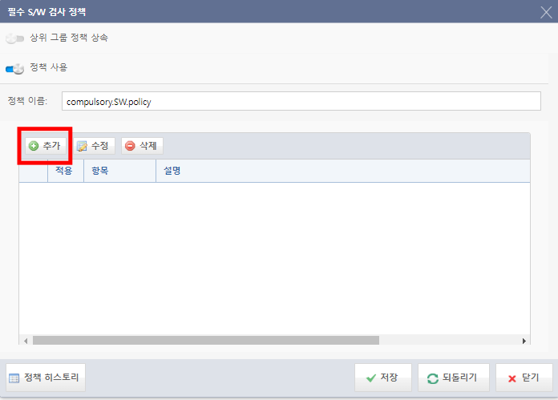

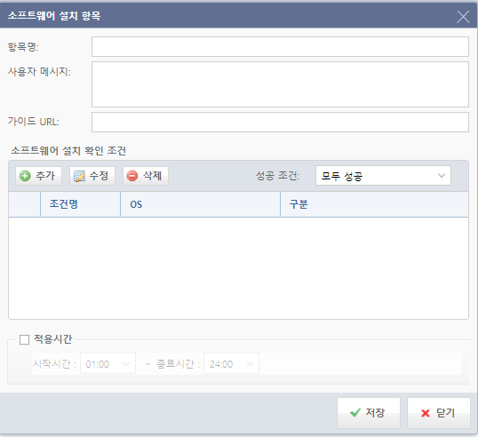

``````
ⓐ 항목명 : 필수 S/W 항목 명을 입력합니다. 1~50자까지 가능합니다.
ⓑ 사용자 메시지 : 검사 실패 시 사용자에게 보여질 메시지를 입력합니다. 
메시지는 1~500자까지 가능합니다.
ⓒ 가이드 URL : 파일 설치 시의 가이드를 보여줄 URL을 설정할 수 있습니다.
ⓓ 판별 조건 : 필수 S/W 설치 여부의 판별 조건을 레지스트리, 파일, 프로세스, 서
비스로 등록 합니다.
설치 확인 조건 추가 [3.4.3.3 판별 조건 등록] 참조
※ 판별 성공 조건 : 등록한 판별 조건의 성공 조건을 지정합니다.
- 모두 성공 : 등록한 판별 조건을 모두 만족해야 무결성 검사를 성공합니다.
- 1개 이상 성공 : 등록한 판별 조건 중 하나 이상이 설치 되었을 때 무결성
검사를 성공합니다.
ⓔ 설치 파일 지정 : 필수 S/W의 설치 파일을 지정합니다.
- [설치 파일 없음]은 별도로 관리자가 설치유도를 하지 않습니다.
- [URL 지정] 시 사용자에게 URL 페이지를 링크해줍니다.
- [파일 업로드] 관리자가 지정한 파일 경로를 통해서 설치파일을 업로드 합니다.
ⓕ 자동 설치 : 파일 첨부 시 자동으로 필수 S/W를 다운받습니다.
ⓖ 적용 시간 : 필수 S/W 설치 확인이 적용될 시간을 설정합니다.
``````

### 판별 조건 등록

#### 레지스트리 등록시

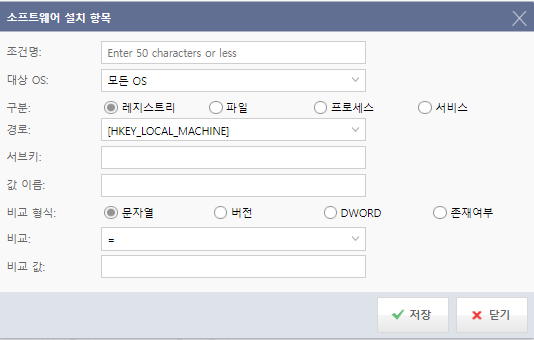

``````
- 조건 명 : 판별 조건 이름을 입력합니다. 1~50자까지 가능합니다.
- 대상OS : 해당 OS를 선택합니다. 
- 구분 : 레지스트리, 파일, 프로세스, 서비스 중 선택합니다.
- 프로세스명 : 해당 S/W의 프로세스 명을 입력합니다.
- 비교 : 존재, 존재하지 않음 중 선택합니다.
``````


``````
- 레지스트리로 등록 시에는 해당 레지스트리 경로를 찾아 값을 비교한 후 판별 조건 에
부합하는 지를 알아봅니다. 
※ 경로 : 레지스트리 경로를 선택한 후 해당 서브 키, 해당 값 이름을 입력합니다.
※ 서브 키 : 레지스트리에 있는 최하위 디렉터리까지의 경로를 입력해야 합니다. 
최대 255자까지 입력이 가능합니다.
- 서브 키 안에 경로를 제외한 값을 입력합니다.
Ex) SOFTWARE\FileZilla 3\fzshellext
``````

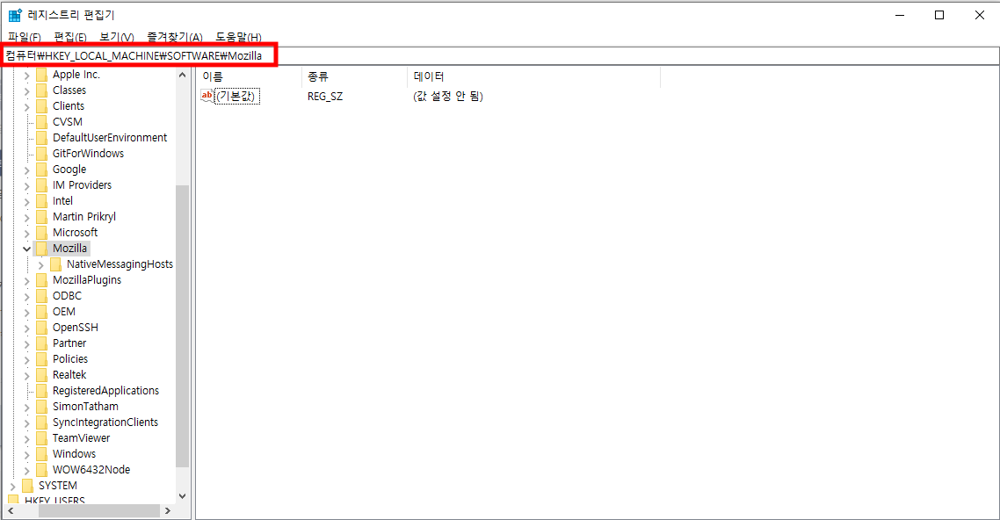

``````
※ 값 이름 : 데이터 값을 입력해야 합니다. 최대 255자 입력 가능합니다.
※ 비교 형식 : 문자열, 버전, DWORD, 존재 여부가 있습니다. 비교 형식에 따라 비교 및
비교 값이 달라집니다.
``````


``````
<문자열> 
- 비교 : 비교할 기호를 선택합니다.
- 비교 값 : 해당 문자열 값을 입력합니다. 최대 255자 입력 가능합니다.
``````

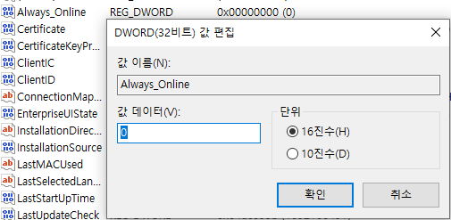

``````
<DWORD> 
- 비교 : 비교할 기호를 선택합니다.
- 비교 값 : REG_DWORD (10진수) 값을 입력합니다. 최대 255자 입력 가능합니다.
``````


``````
※ <존재 여부> 비교 : 값 이름의 존재 유무를 선택합니다.
``````

#### 파일로 등록 시

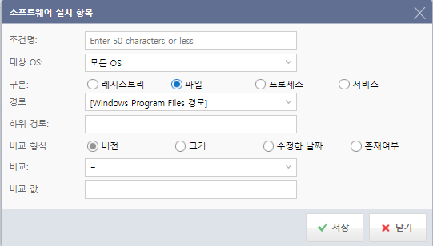

``````
- 파일로 등록 시에는 경로를 선택하고, 하위 경로를 입력합니다.
- 비교 형식은 버전 (해당 소프트웨어 버전), 크기, 수정한 날짜, 존재 여부 중 하나
를 선택할 수 있습니다
``````

#### 프로세스로 등록 시


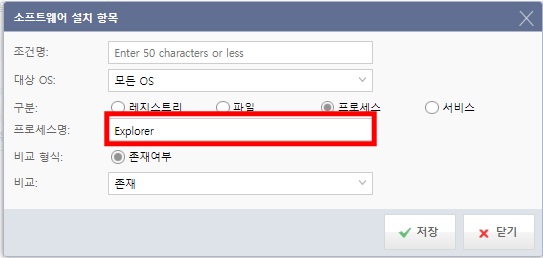

``````
- 프로세스로 등록 시에는 해당 프로그램의 프로세스 명을 입력하여 등록합니다.
``````

#### 서비스로 등록 시

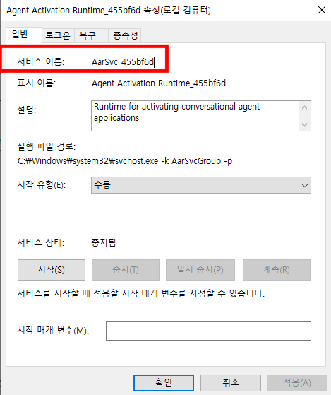

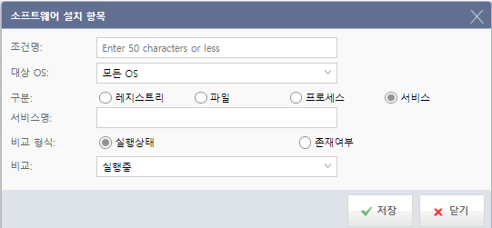

``````
해당 프로그램의 서비스 명을 입력합니다. 
이 때의 서비스 명은 서비스의 표시 이름이 아닌 서비스 이름을 입력해주어야 합니다.
최대 255자 입력 가능 합니다.
- 실행 상태일 경우: 해당 서비스가 실행 중/중지됨 임을 선택합니다.
- 존재 여부의 경우: 해당 서비스의 존재 유무를 선택합니다
``````

## 악성 S/W 검사 정책

```
- 악성 S/W를 등록, 설정하여 발견 시 네트워크를 차단할 수 있습니다.
```

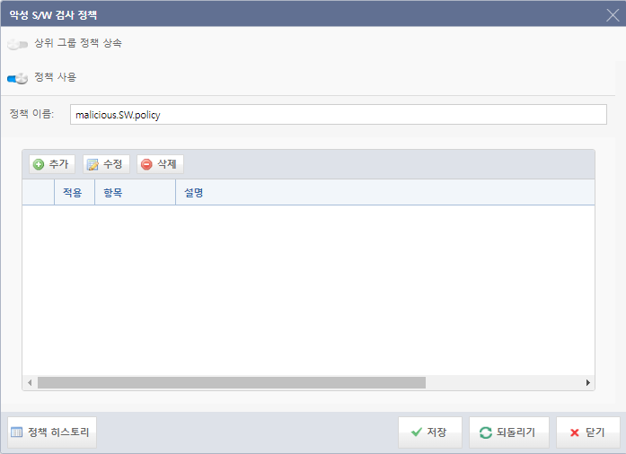

```
판별 조건 등록은 '필수 S/W 검사 정책' 란과 동일하다.
```

## 백신 검사 정책

```
- 검사할 해당 백신프로그램을 선택하여 에이전트를 검사합니다. 미 설치 상태에서는 설
치를 유도하여 설치하게 합니다.
```

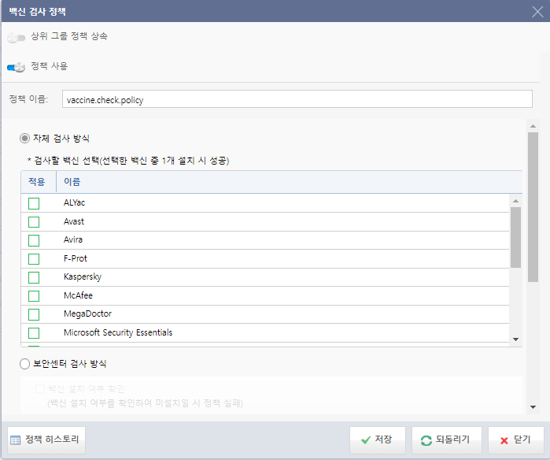

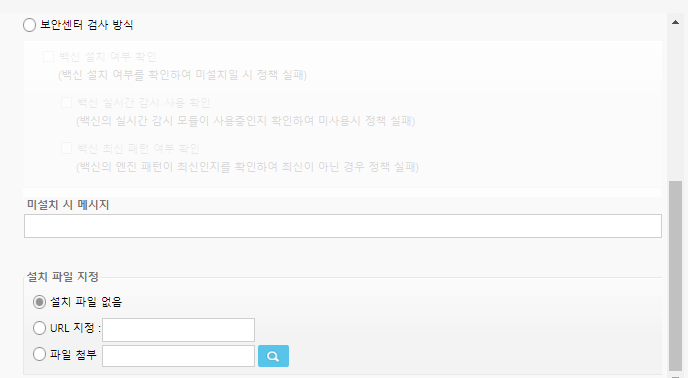

```
ⓐ 정책 사용 : 백신 검사 정책 사용 유무를 설정합니다.
ⓑ 검사 방식 : 자체 검사 방식과 보안센터 검사 방식 중 하나만 선택 할 수 있습니다.
1) 자체 검사 방식 : 검사 할 백신을 선택합니다.
※ 여러 백신을 선택해도 그 중 하나의 백신만 설치되어 있다면 무결성 검사를 성
공합니다.
2) 보안센터 검사 방식 : 윈도우 보안센터의 정보를 이용하여 백신 상태를 검사합니다.
- 백신 설치 여부 확인: 보안센터에 백신설치(등록) 여부를 검사합니다.
- 백신 실시간 감시 사용 확인: 보안센터에 등록된 백신 실시간 감시 동작 여부를
검사합니다.
- 백신 최신 패턴 여부 확인: 보안센터에 등록된 백신이 최신 패턴인지를 검사합니
다.
ⓒ 미 설치 시 메시지 : 미 설치 시 메시지를 설정할 수 있습니다. 메시지는 1~500자까
지 입력 가능합니다.
ⓓ 설치 파일 지정 : [설치 파일 없음]은 설치 파일을 첨부하지 않습니다.
- [URL 지정] 시 사용자에게 URL 페이지를 링크해줍니다.
- [파일 업로드] 시 관리자가 지정한 파일 경로를 통해서 설치 파일을 업로드 합니다.
```

## 불법 S/W 검사 정책

```
- Tco!stream과 연동하거나 관리자가 직접 불법S/W목록을 등록해서 발견 시 네트워크를
차단 할 수 있습니다. 
```
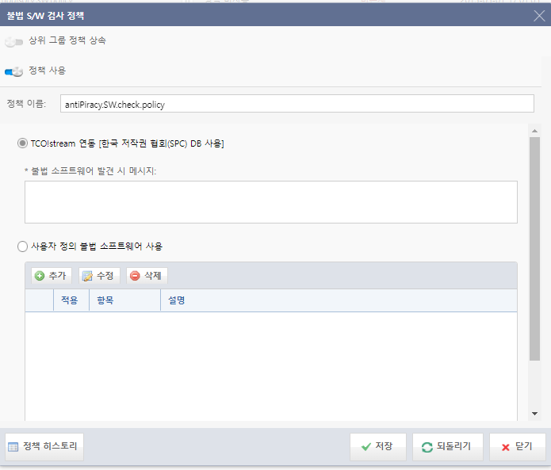

```
ⓐ 정책 사용 : 불법 S/W 검사 정책 사용 유무를 설정합니다.
ⓑ TCO!stream 연동 : 연동 시 한국 저작권 협회 데이터 베이스에 있는 불법 소프트웨어
목록 중 TCO에서 관리자가 인가 하지 않은 소프트웨어 사용 시 무결성 검사에 위배되는
사용자를 검출 할 수 있습니다. 검출된 사용자는 TCO Stream에서 불법 소프트웨어의 삭
제를 유도합니다. (TCO!stream 설치 된 환경에서만 연동 가능)
ⓒ 불법 S/W 발견 시 메시지 : 불법 S/W 발견 시 메시지를 설정할 수 있습니다. 메시지
는 1~500자까지 입력 가능합니다.
ⓓ 사용자 정의 불법 S/W 사용 : 관리자가 직접 불법 S/W 목록을 등록하여 무결성 검사
를 실행하게 됩니다.
※ S/W항목은 [3.4.3.3 판별 조건 등록]을 참조해 주시기 바랍니다
```

## OS 업데이트 정책

```
- 윈도우 업데이트에 대한 정책을 설정할 수 있습니다.
- 파일서버는 패치파일 목록을 다운로드 받기 위해 기본적으로 통신 차단이 예외 됩니다. 
※ 정책을 사용할 경우 패치목록이 존재할 시 무결성 검사가 실패로 처리되며, 
네트워크가 차단될 수 있습니다. 단, 패치가 진행중인 상태(다운로드 중, 다운로드
완료, 재부팅 대기중 등)에서는 무결성 검사가 성공으로 진행됩니다.
```

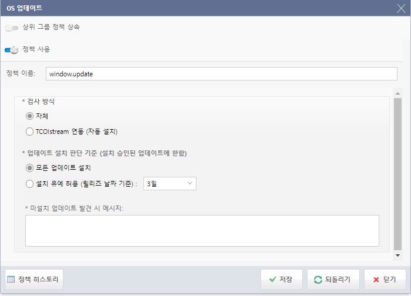

```
ⓐ 정책 사용 : OS 업데이트 정책 사용 유무를 설정합니다.
ⓑ 검사 방식
- 자체: Tgate 자체 검사방식을 이용하여 업데이트 준수여부 검사를 진행합니다. 
- TCO!stream 연동: TCO!stream 과 연동하여 업데이트 준수여부 검사를 진행합니다.
( TCO!stream 설치 된 환경에서만 연동 가능 )
ⓒ 업데이트 설치 판단 기준
－ 모든 업데이트 설치: 신규 릴리즈 된 업데이트 목록이 설치 되어있지 않으면 즉시
무결성 검사가 실패되며, 업데이트가 진행됩니다. 
－ 설치 유예 허용: 신규 릴리즈 된 업데이트 목록이 존재하여도 관리자가 설정한
일정 기간 동안 유예를 허용합니다.
ⓓ 미 설치 업데이트 발견 시 메시지 : 미 설치 업데이트를 발견 시 메시지를 설정할 수
있습니다. 메시지는 1~500 자까지 입력 가능합니다.
```

```
① 에이전트 ( OS 업데이트 정책 )
- OS 업데이트 정책을 사용하고 사용자 PC 에 패치 목록이 존재할 경우 무결성 검사가
실패되며, 사용자는 업데이트 목록을 확인 및 설치를 진행할 수 있습니다. 
```

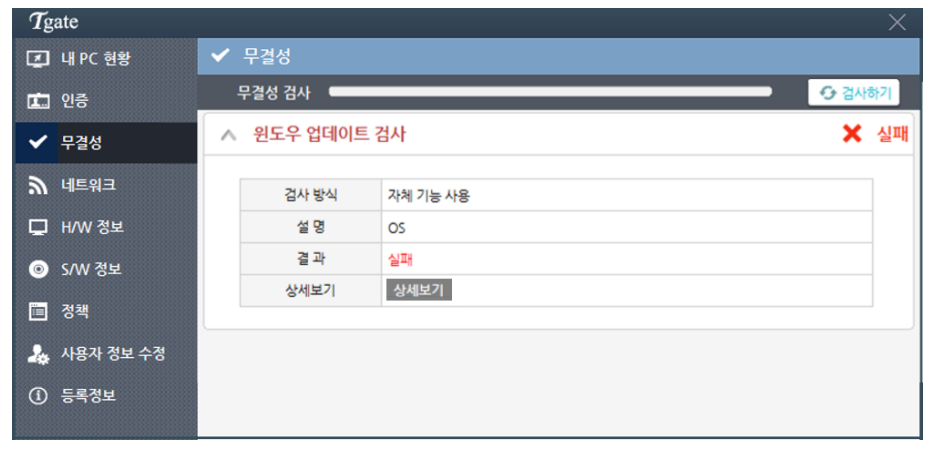


```
네트워크 차단정책을 사용하는 경우 업데이트 이후 무결성 재검사를 진행해야
네트워크 사용이 가능합니다.
```

##  유해 트래픽 모니터링 정책

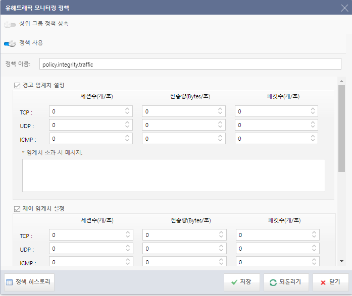


```
ⓐ 정책 사용 : 유해 트래픽 모니터링 정책 사용 유무를 정합니다.
ⓑ 경고 임계치 설정 : 경고 임계치를 설정하면, 트래픽 초과 시 차단하지 않고, 경고메시지만 발생 시킵니다.
※ 임계치 초과 시 메시지 : 임계치 초과 시 메시지를 설정할 수 있습니다.
메시지는 1~500 자까지 입력 가능합니다.
ⓒ 제어 임계치 설정 : 제어 임계치를 설정하면 트래픽 초과 시 네트워크를 차단합니다.
※ 임계치 초과시 제어 방법
－ 해당 에이전트의 네트워크를 차단시키거나 해당 에이전트 PC 의 전원을 종료
시킵니다.
－ 대기 시간을 설정하여, 에이전트에 유예시간을 부여할 수 있습니다.
ⓓ 예외 IP 설정 : 유해 트래픽 차단 정책 예외 IP 설정 기능은 관리자가 설정한
임계치에 대한 데이터 흐름을 감시하지 않습니다.
```

## 윈도우 보안 정책 1

```
- 윈도우 운영체제의 기본적인 보안 정책을 설정할 수 있습니다.
```

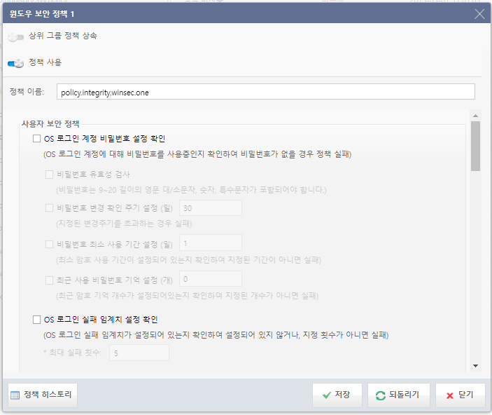

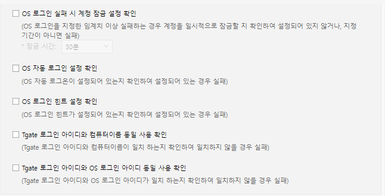


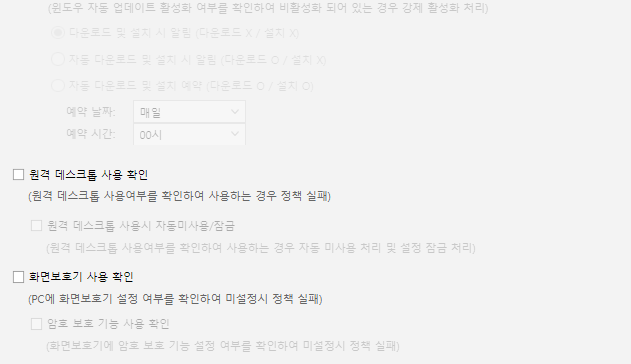

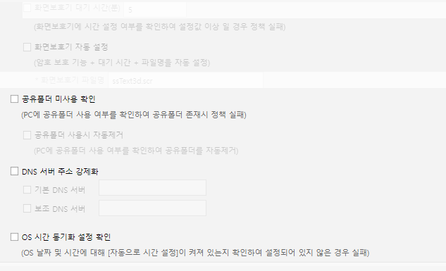

```
- 정책 사용 : 윈도우 보안 정책 사용 유무를 설정합니다.
- OS 로그인 계정 비밀번호 설정 확인 : OS 계정 로그인 시 비밀번호를 사용 유무를 확
인합니다.
- OS 로그인 실패 임계치 설정 확인 : OS 로그인 실패 임계치가 설정되어 있으며, 지정
횟수가 정책 지정횟수와 맞는지 확인합니다.
- OS 로그인 실패 시 계정 잠금 설정 확인 : OS 로그인 실패 횟수를 넘어가면 계정을
잠그며, 잠금 시간이 정책 지정시간과 맞는지 확인합니다.
- OS 자동 로그인 설정 확인 : OS 자동 로그인이 설정 되어있는지 확인합니다.
- OS 로그인 힌트 설정 확인 : OS 로그인 힌트가 설정 되어있는지 확인합니다.
- Tgate 로그인 아이디와 컴퓨터이름 동일 사용 확인 : Tgate 로그인 아이디와 컴퓨터이
름이 일치하는지 확인합니다.
- Tgate 로그인 아이디와 OS 로그인 아이디 동일 사용 확인 : Tgate 로그인 아이디와
 로그인 아이디가 일치하는지 확인합니다.
- ActiveX 차단 설정 : ActiveX 컨트롤 및 플러그인 사용을 확인 합니다.
- 임시인터넷 파일 삭제 : 정책 검사 주기마다 임시 인터넷 파일을 삭제 합니다.
- 팝업 차단 설정 : 팝업이 차단 설정 되었는지 확인 합니다.
- Guest 계정 미사용 확인 : Guest 계정을 사용하는지 확인 합니다.
- 윈도우 방화벽 사용 확인 : 윈도우 방화벽이 활성화 되어있는지 확인 합니다.
- 윈도우 자동 업데이트 사용 확인 : 윈도우 업데이트가 자동으로 되어있는지 확인 합니
다.
- 원격 데스크톱 사용 확인 : 원격 데스크톱 사용을 확인하고 사용하면 정책이 실패가
됩니다.
- 원격 데스크톱 사용 확인 : 원격 데스크 사용 여부를 확인합니다.
- 화면 보호기 사용 확인 : PC에 화면 보호기 설정 여부를 확인 합니다.
- 공유 폴더 미사용 확인 : PC에 공유 폴더가 있는지 확인합니다.
- 공유 폴더 사용시 자동 제거 : 공유 폴더가 있으면 자동으로 제거 합니다.
- DNS 서버 주소 강제화 : 에이전트 DNS주소를 강제적으로 변경할 수 있습니다.
- OS 시간 동기화 설정 확인 : 날짜 및 시간 동기화 설정 확인합니다.
```

##  개인정보보호 무결성 정책

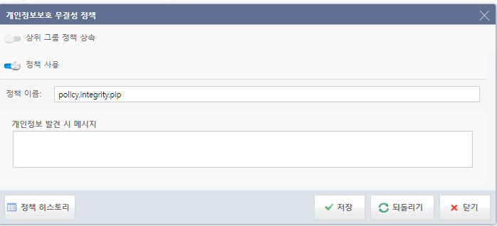

```
ⓐ 정책 사용 : 개인정보보호 무결성 정책 사용 유무를 설정합니다.
ⓑ 개인정보 발견 시 메시지 : 개인 정보 발견 시 사용자에게 보여질 메시지를 입력합니다.
```

## 윈도우 보안 정책 2


```
ⓐ 정책 사용 : 윈도우 보안 정책2 사용 유무를 설정합니다.
ⓑ 수집 스케줄 설정
- 수집 시간 설정 : 윈도우 보안 정책 수행을 위한 정보 수집 시간을 설정 합니다.
- 주기 별 수집 : 일, 시간, 분의 단위로 수집 주기를 설정할 수 있습니다.
- 부팅 시 수집 : 부팅 시 매번 수집할지, 매일 첫 부팅 시 1회 수집할 지를 정할
수 있습니다
```

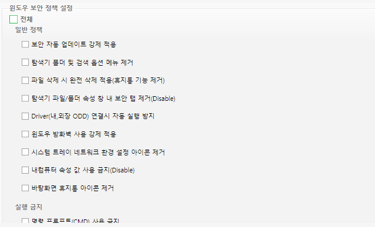


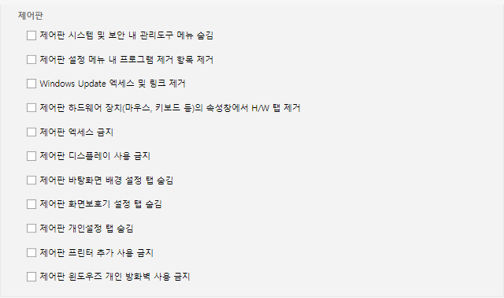

```
ⓒ 윈도우 보안 정책 전체 선택 : 윈도우 보안 정책 2 를 모두 선택 합니다.
ⓓ, ⓔ, ⓕ, ⓖ 윈도우 보안 정책 설정 : 윈도우 보안을 위한 각종 기능을 적용하거나 보
안의 취약점이 될 수 있는 항목을 제거 또는 접근 제어합니다.
※ 컴퓨터를 종료하지 못하거나 cmd를 사용하지 못 하는 등의 윈도우 기본 기능 제약이
있으니 신중하게 생각하시고 적용하시기 바랍니다
```

# 매체제어

```
사용자들의 장치 단말을 사용 제한 및 관리할 수 있습니다.
```

# 개인 정보

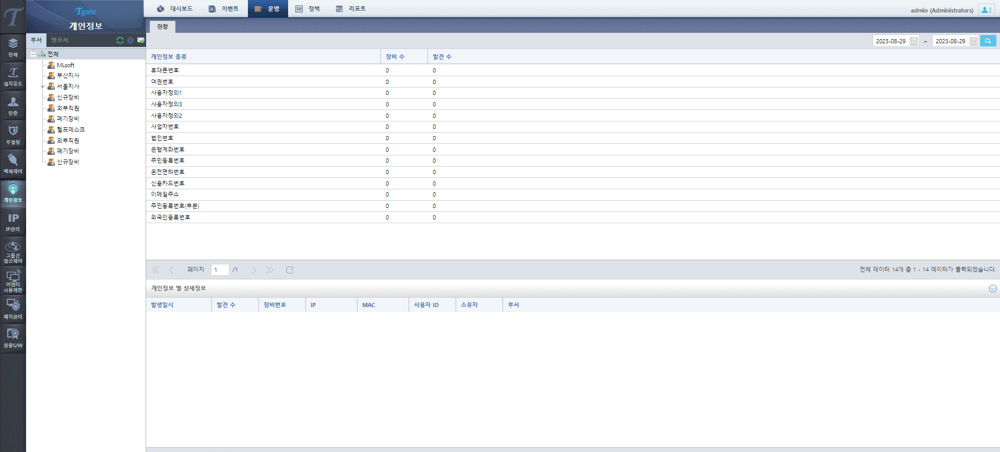

```
ⓐ 개인 정보 종류 : 개인 정보가 발견된 장비와 개수를 확인할 수 있습니다.
ⓑ 개인 정보 상세정보 : 개인 정보가 발견된 항목을 더블 클릭하면 발생 일시, 발견 수, 
장비 번호 등 장비의 상세정보를 확인할 수 있습니다.
```

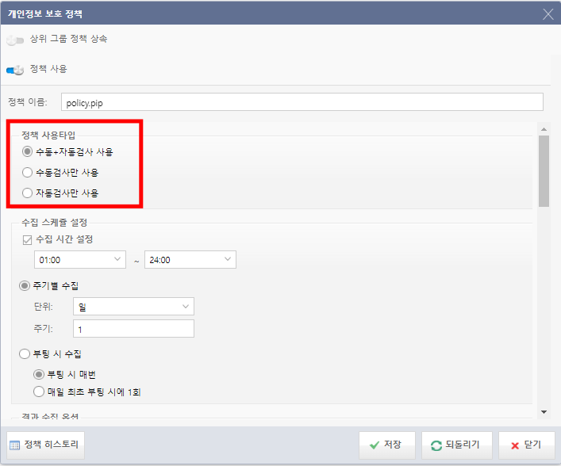

```
ⓐ 정책 사용 : 개인정보 보호 정책 사용 유무를 설정합니다.
ⓑ 정책 사용타입
- 수동 + 자동검사 사용 : 수동검사와 자동검사를 모두 사용합니다.
- 수동검사만 사용 : 사용자가 수동으로 무결성 검사를 했을 때만 검사합니다.
- 자동검사만 사용 : 주기 별 수집을 설정한 시간마다 자동으로 검사합니다.
```

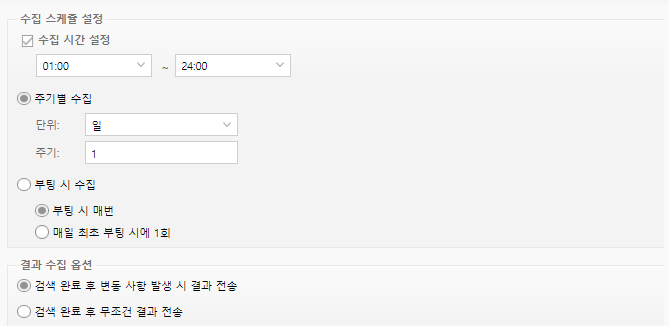

```
ⓒ 수집 스케줄 설정
- 수집 시간 설정 : 개인 정보 수집 시간을 설정 합니다.
- 주기 별 수집 : 일, 시간, 분의 단위로 수집 주기를 설정할 수 있습니다.
- 부팅 시 수집 : 부팅 시 매번 수집할지, 매일 첫 부팅 시 1회 수집할 지를 정할
수 있습니다.
ⓓ 결과 수집 옵션
- 검색 완료 후 변동 사항 발생 시 결과 전송 : 수집 후 기존과 수집 정보가 다를
경우 수집 정보를 서버에 전송합니다.
- 검색 완료 후 무조건 결과 전송: 수집 후 기존과 수집 정보가 같아도 수집 정보
를 서버에 전송합니다.
```

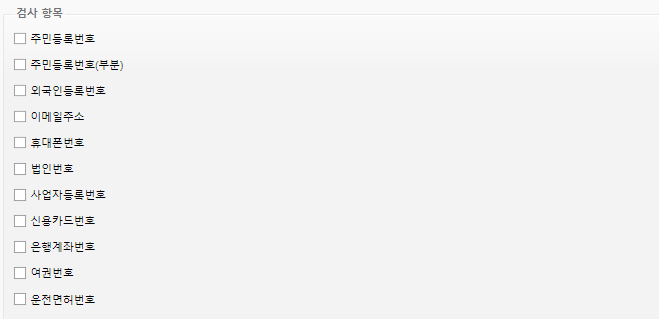

```
ⓔ 검사 항목 : 어떤 개인 정보 항목을 검사 할 것인지 선택 합니다.
ⓕ 사용자 정의 패턴
- 이름 : 패턴 이름 입력합니다.
- 패턴 : 정규 표현식으로 입력합니다 .
```

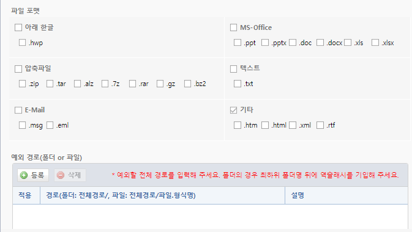

```
ⓖ 파일 포맷 : 검사할 파일의 포맷을 선택합니다.
ⓗ 예외 경로 : 개인 정보 검사를 제외할 폴더나 파일의 위치를 등록합니다.
```

---

# 그룹간 접근제어

```
- 사용자/장비들의 네트워크 어댑터를 관리하고, 차단 및 허가 동작을 수행할 수 있다.
```

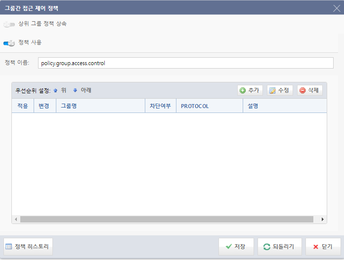

```
ⓐ 정책 사용 : 그룹간 접근제어 정책 사용 유무를 설정합니다.
ⓑ 우선 순위 설정 : 그룹 우선 순위를 설정합니다.
ⓒ 제어 관리 그룹을 등록/수정/삭제할 수 있습니다.
※ 자세한 내용은 [① 제어관리 그룹 등록 정보] 을 참조하시기 바랍니다.
ⓓ 제어 관리 그룹이 우선 순위가 높은 순으로 보여집니다.
ⓔ 기간 설정 : 정책을 사용할 기간을 선택합니다.
```

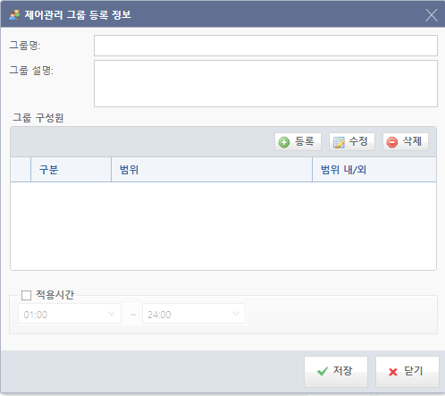

```
ⓐ 그룹 명 : 접근 제어 그룹 명을 입력합니다.
ⓑ 그룹 설명 : 그룹에 대한 설명을 입력합니다.
ⓒ 그룹 구성원 : 그룹에 포함 시킬 구성원을 구성합니다.
※ 자세한 내용은 [② 그룹구성원 등록]을 참조하시기 바랍니다.
ⓓ 적용 시간 : 그룹간 접근제어를 적용할 시간을 선택합니다.
```

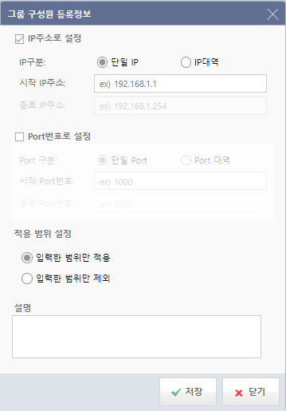

```
ⓐ IP주소로 설정 : IP 주소(단일 IP, 범위 IP)로 그룹 구성원을 생성합니다.
※ 시작 IP는 종료 IP보다 작아야 합니다.
ⓑ Port 번호로 설정 : 포트 번호(단일 Port, 범위 Port)로 그룹 구성원을 생성합니다.
※ 시작 Port는 종료 Port보다 작아야 합니다.
ⓒ 범위 설정 : 그룹구성원으로 생성할 범위를 입력한 범위만 할지 또는 입력한 범위만 제
외할지 선택합니다.
ⓓ 설명 : 해당 그룹 구성원에 대한 설명을 입력 할 수 있습니다
```

---

# 어댑터 사용제한


