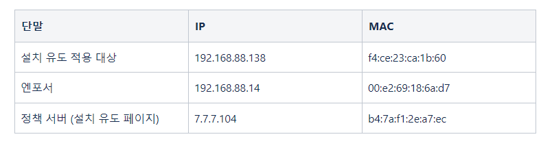
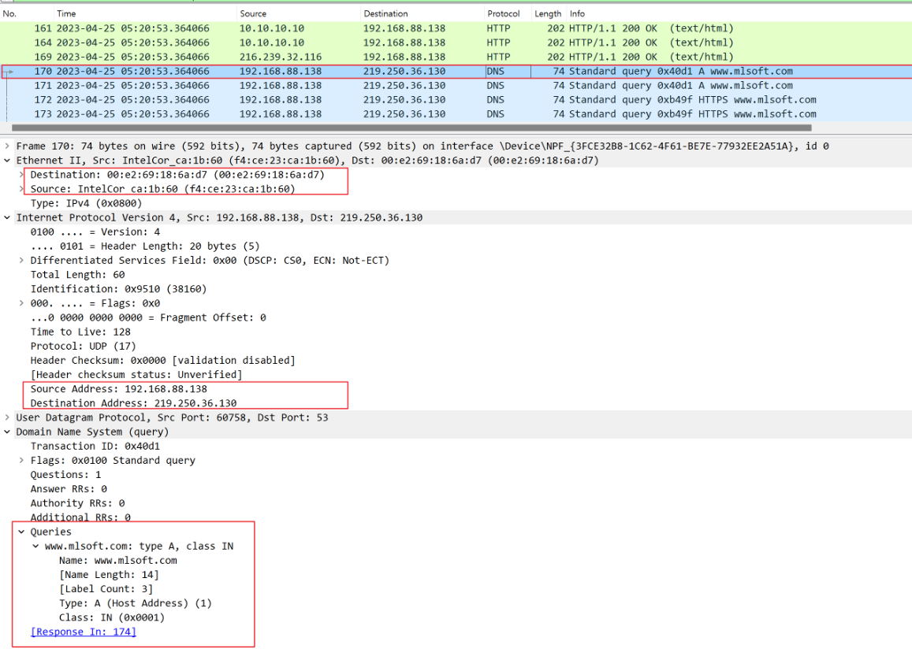
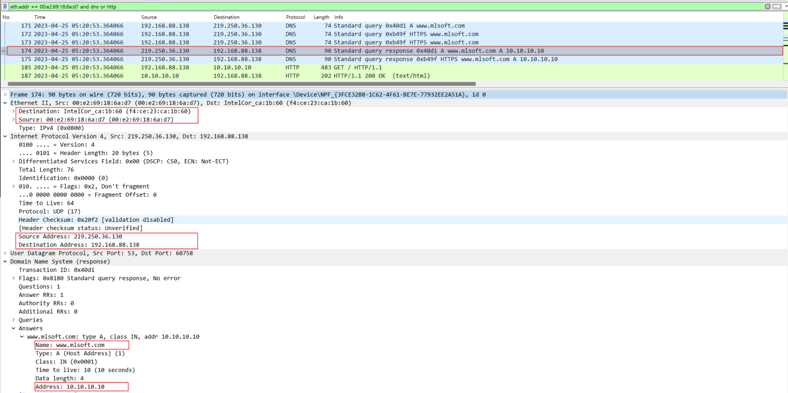
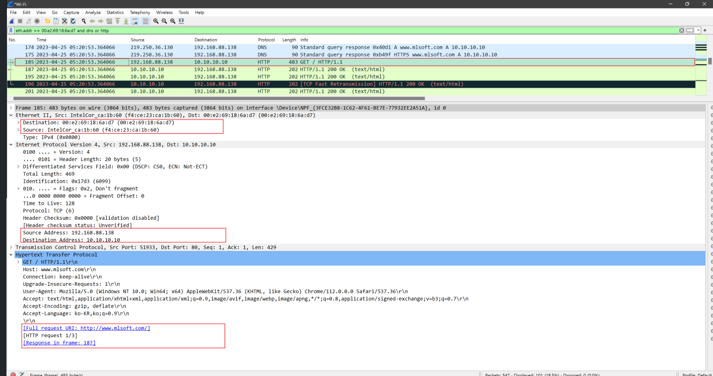
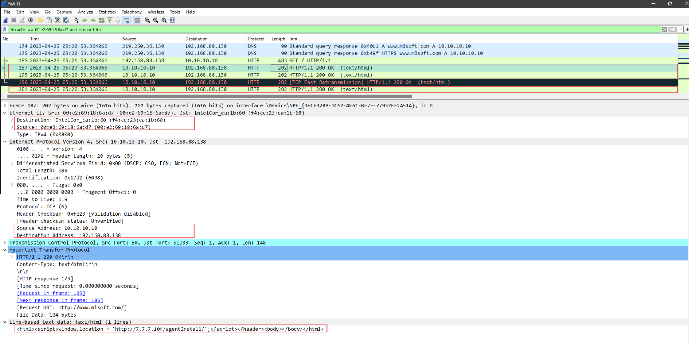
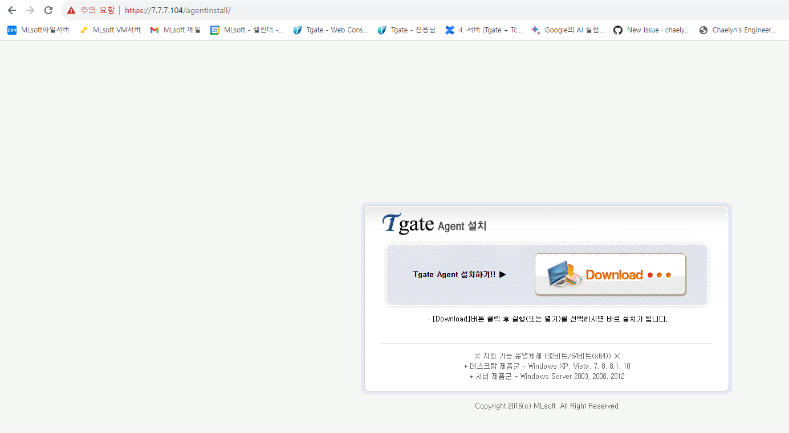

# 설치유도 정책 동작 과정


```
단말, 엔포서, 정책 서버의 IP 및 MAC 정보
```



```
1. 단말에서 DNS 서버로 www.mlsoft.com 의 도메인을 요청.
```



```
DNS서버가 아닌 엔포서에서 단말에게 도메인에 대한 IP주소를 거짓 회신.
```



```
3. 거짓 회신받은 단말에서 IP 10.10.10.10의 HTTP 웹 페이지를 요청
```



```
엔포에서에서 10.10.10.10 대역의 웹페이지를 단말에게 설치 유도페이지로 회신.
```



```
https://7.7.7.104/agentInstall/
단말에서 WWW.mlsoft.com 도메인에 대한 페이지가 `설치유도` 페이지로 나타남을 확인할 수 있다.
```
