# Tcosecuip Process Flow Map

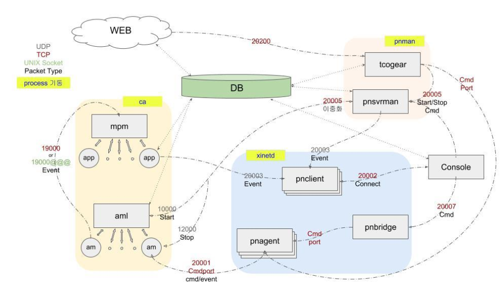

* pnclient : C/S 콘솔과 서버의 명령 처리 중계 (/home/tcosecuip/log)

* pnman : pnsvrman, pnFastTP, tcogear, tcogetsnmp 프로세스의 관리 (/home/tcosecuip/log)

* pnsvrman : pnagent 시작 / 중지, 이중화, 이벤트 처리 (/home/tcosecuip/log)

* pnbridge : pnagent 시작 / 중지 외 명령 처리 (/home/tcosecuip/log)

* pnFastTP : ca 프로세스 관리 (/home/tcosecuip/log)

* tcogear : WEB과 서버의 명령 처리 중계 (/home/tcosecuip/log)

* ca : mpm, ami 프로세스 관리 (/home/tcosecuip/log)

* mpm : mpm_agent_s 프로세스 관리 (/home/tcosecuip/FastTP/log)

* mpm_agent_s : tcoseucip DB를 쓰고 읽음 (/home/tcosecuip/FastTP/app/log)

* aml : am 프로세스 관리  (/home/tcosecuip/FastTP/log)

* am : pnagent에 명령 전달 (/home/tcosecuip/FastTP/log)

* tcogetsnmp : 스위치 포트 정보 수집을 위한 snmp 처리 (/home/tcosecuip/log)

* pnagent(엔포서) : IP관리 명령 처리 (/home/tcosecuip/log)

---


## Pnagent 동작 Process

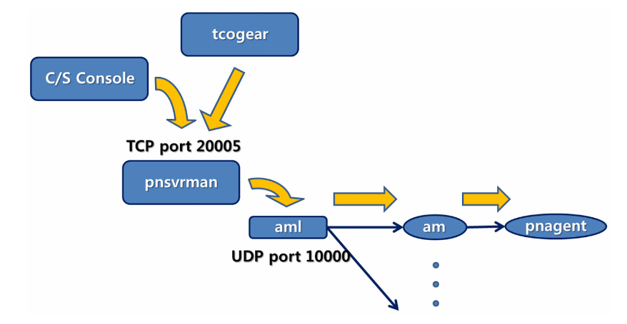

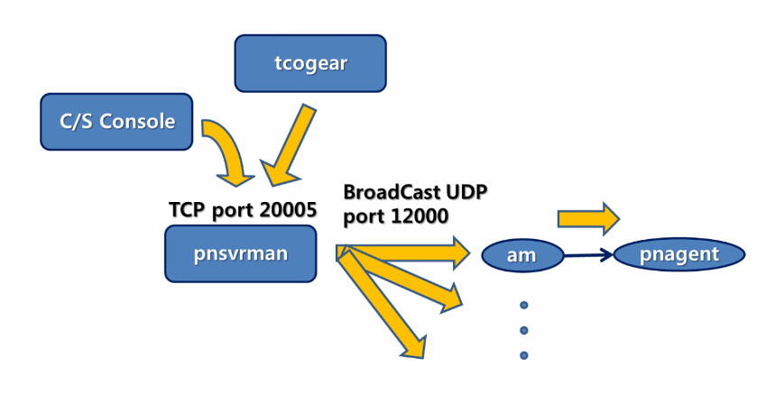


---


## IP삭제, 차단, 보호모드 등 동작 Process

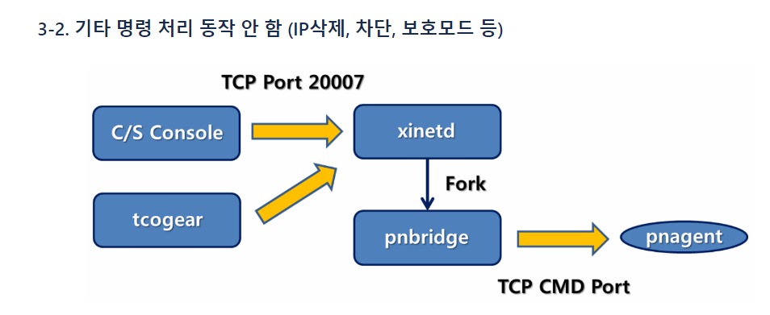

---

### IP 보호모드 명령 시 로그 수집 실습

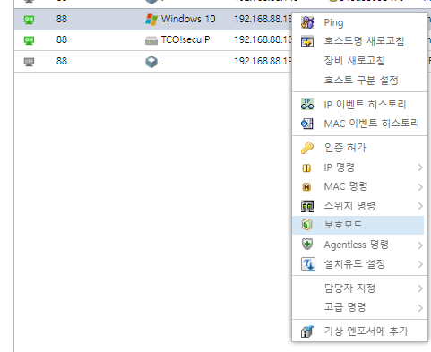
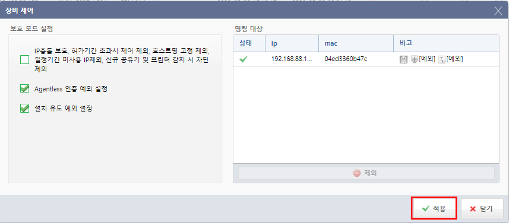

```
web console 에서 내 PC (192.168.88.180)에 대한 보호모드 설정
```

#### pnsvrman : pnagent 시작 /중지, 이중화, 이벤트

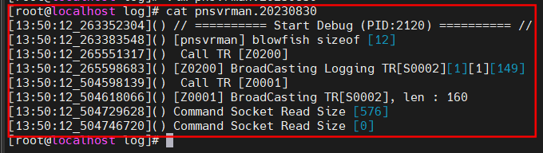
```
cat /home/tcosecuip/log/pnsvrman.20230830
!
start Debug 확인
!
```

---

#### tcogear : WEB과 서버의 명령 처리 중계

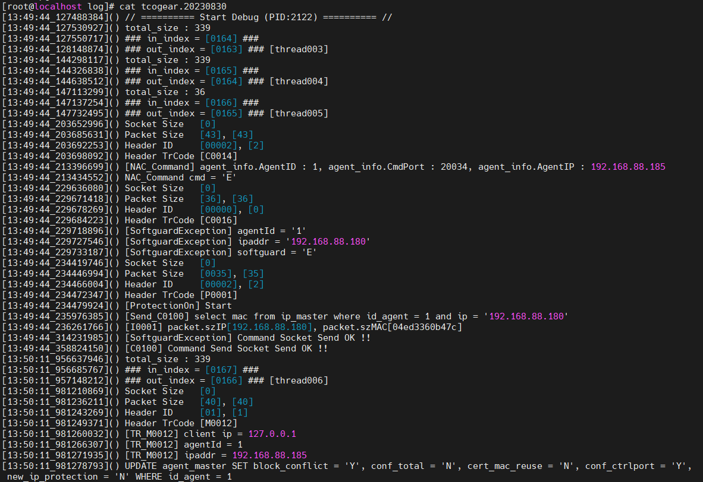

```
cat /home/tcosecuip/log/tcogear.20230830
!
start Debug 확인
!
```

#### app.log : web 관련은 tcogear, c/s console일때는 해당 로그로 확인.

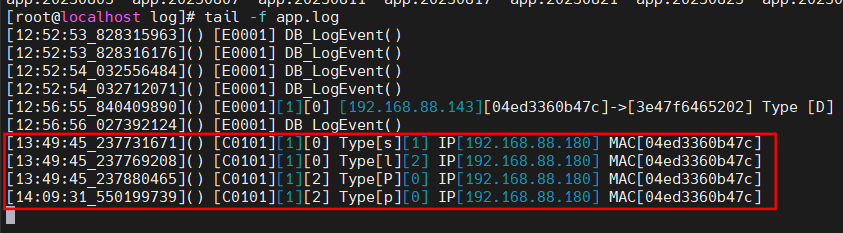

```
tail -f app.log
보호명령을 설정한 내 PC (192.168.88.180) 에 대한 로그 수집을 확인.
```

---

#### pnagent (enforcer) : IP관리 명령 처리 ( /home/tcosecuip/log)

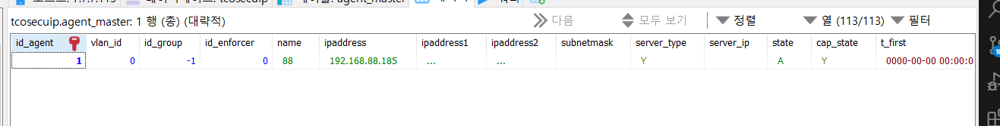

```
heidsql에서 엔포서 IP로 접속하여 enforcer의 id_agent number 1인 것을 확인. 
(웹 개발자모드에서도 확인할 수 있으나 먼저 heidsql 또는 mysql로 확인하는 것을 권장. 안될시 웹 에서 개발자모드로 확인)
/home/tcosecuip/log/pnagent1.log를 확인하면된다.
```

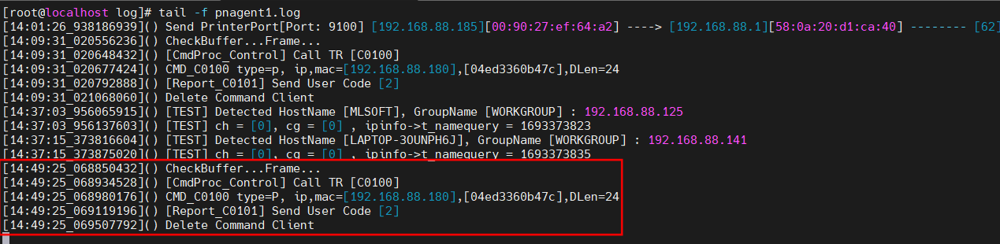

```
web console에서 내 PC에 보호모드 설정 후 log 수집을 확인할 수 있다.
```

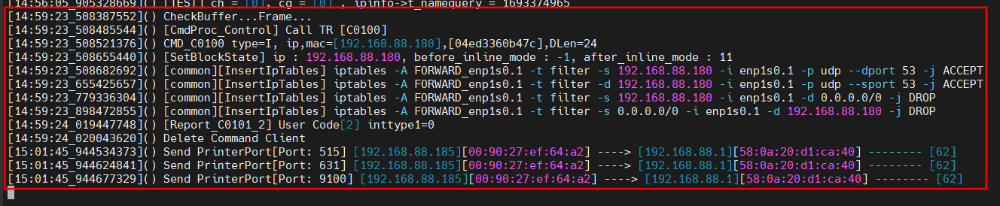

```
IP차단 명령시에 확인할 수 있는 로그이다.
```
---


