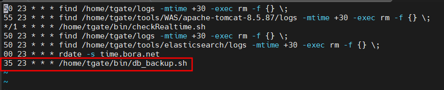
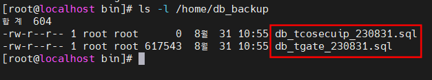

# DB 백업 설정 (MySQL_Dump)

* Tgate, Tcosecuip의 정책, 설정, 장비 정보, 사용자 정보, IP 정보 등을 백업한다.

## 1-1. 백업 스크립트 및 경로 작성

```
mkdir /home/db_backup
touch /home/tgate/bin/db_backup.sh
chmod 755 /home/tgate/bin/db_backup.sh
```


```
vim /home/tgate/bin/db_backup.sh
!
#!/bin/bach
# DB backup

MYSQL_PWD="eoqkrskwk" mysqldump -u root --add-drop-table --set-charset --default-character-set=utf8 tgate > /home/db_backup/db_tgate_$(date +%y%m%d).sql
MYSQL_PWD="eoqkrskwk" mysqldump -u root --add-drop-table --set-charset --default-character-set=euckr tcosecuip > /home/db_backup/db_tcosecuip_$(date +%y%m%d).sql

# backup remove

find /home/db_backup -mtime +30 -exec rm -f {} \;
!

** +30은 DB 백업 본을 삭제하는 주기설정이다.
   고객사의 백업 정책과 DB 및 디스크 용량에 따라 조절하여 작성한다.
```

## 1-2. 스크립트 실행 예약



```
crontab -e
35 23 * * * /home/tgate/bin/db_backup.sh
```

## 1-3. 백업 태스트



```
/home/tgate/bin/db_backup.sh
ls -l /home/db_backup
db_tgate_날짜.sql
db_tcosecuip_날짜.sql
총 2개 파일이 생성되었다면 정상이다.
```
