# 점검서 작성

## 기초정보 


```
# 호스트명
hostname // 호스트명 확인

# IP
ifconfig // 서비스 IP 확인

# HA
ip addr
serviceheartbeat status // centos6인 경우 service heartbeat status 
```

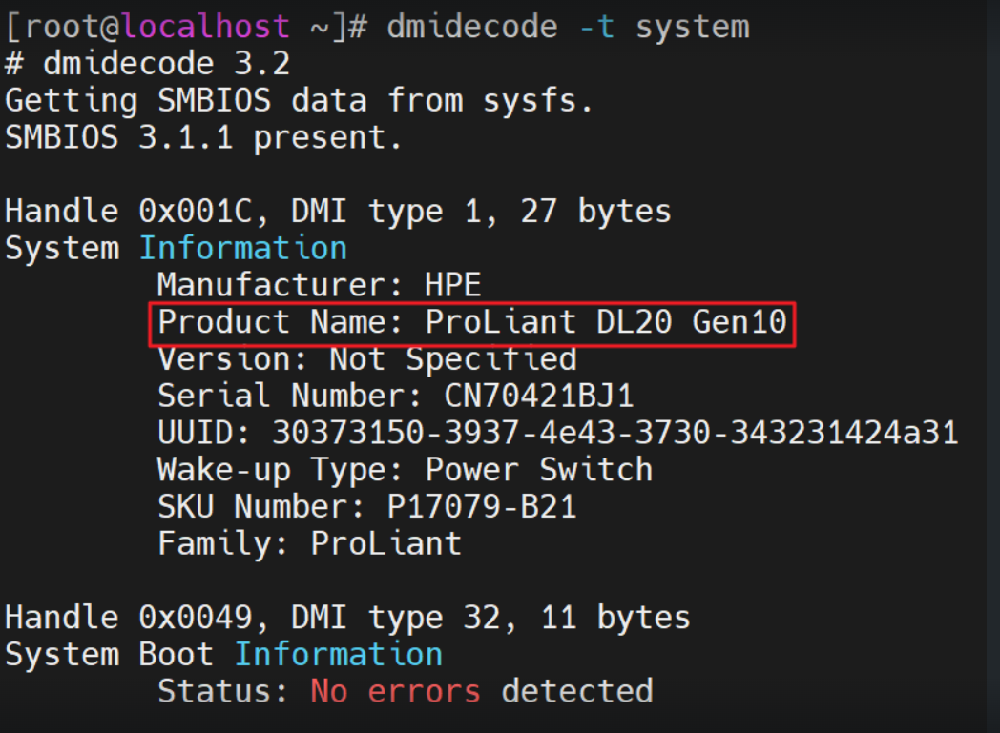


```
# 모델명
dmidecode -t system // product Name 확인
```

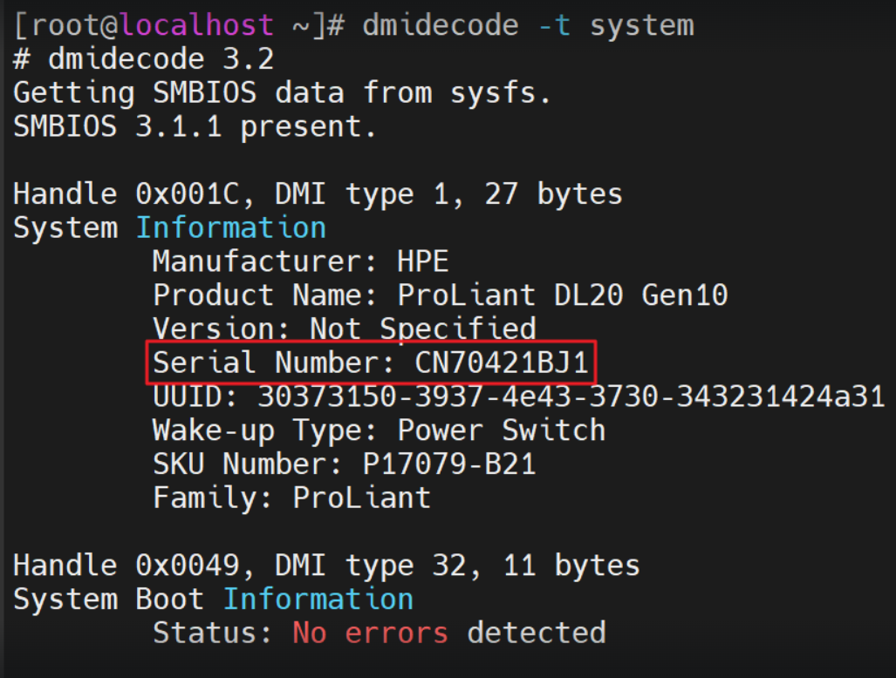

```
# 시리얼
dmidecode -t system // Serial Number 확인
```

---

## HW 정보

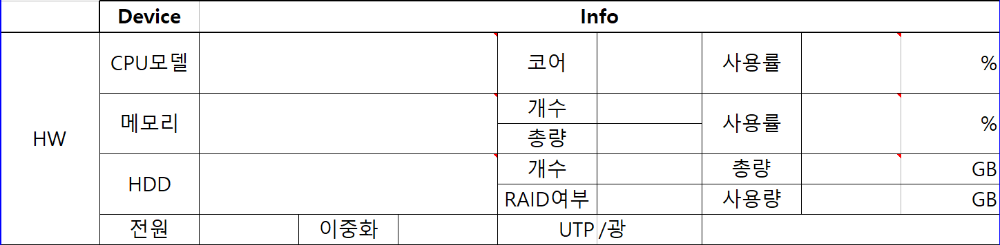

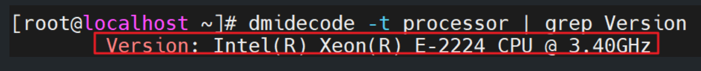

```
# CPU 모델
dmidcode -t processor | grep Version // Version 확인
```

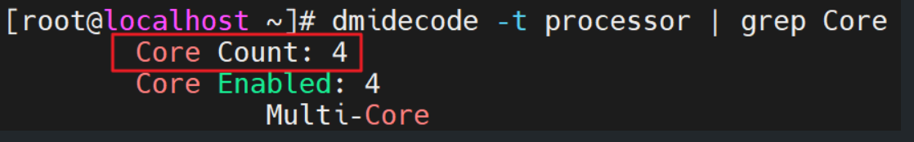

```
# CPU 코어
dmidcode -t processor | grep Core // Core Count 확인
```

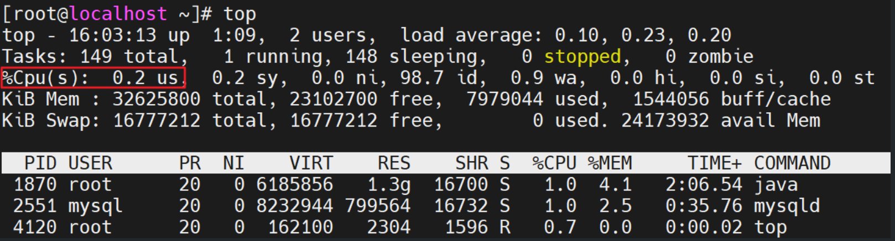

```
top // %Cpu(s) 확인
```

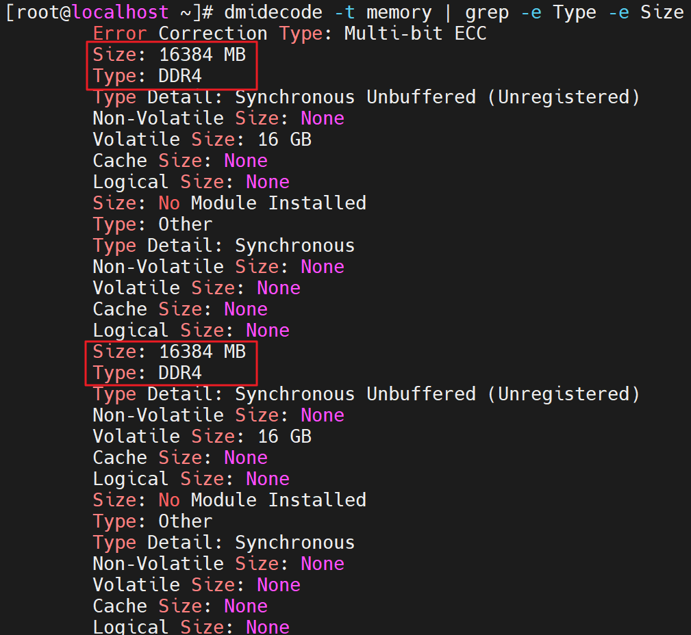

```
# 메모리
dmidecode -t memory | grep -e Size -e Type // Type 및 Size 확인
```


```
# 메모리 개수
dmidecode -t memory | grep -e Size -e Type // 메모리 Type과 Size가 표시되는 슬롯 개수 확인
```

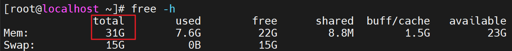

```
# 메모리 총량
free -h // Total 값 확인 (2의 배수로 반올림) 15인 경우 16, 31인 경우 32
```

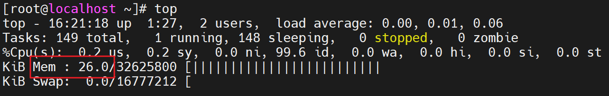

```
# 메모리 사용률
top
m // kib mem 값 입력
```

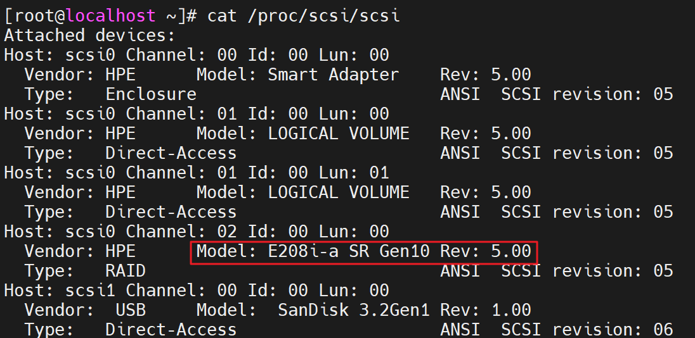

```
# HDD
cat /proc/scsi/scsi  // Raid 구성이 되어 있는 경우 Raid controller 기입, 
                        non Raid 구성인 경우 HDD 모델명 기입
```

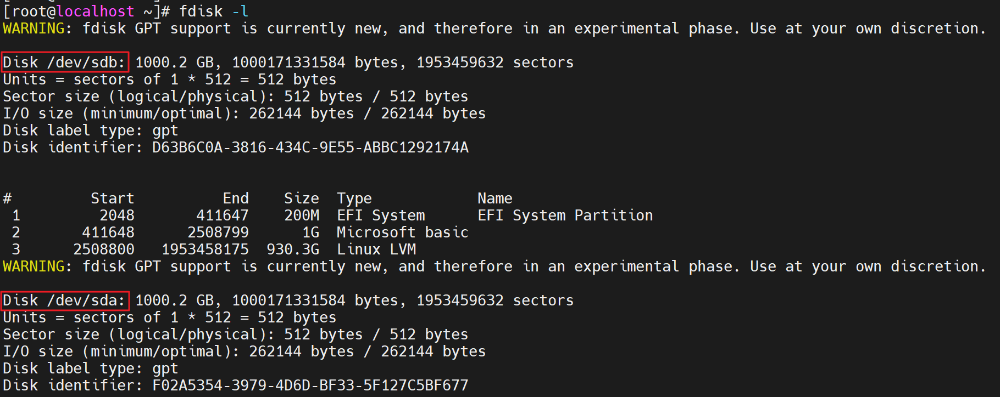

```
# 개수
fdisk -l // Raid 구성이 되어 있는 경우 육안 점검 혹은 별도 tool 필요함
            non Raid 구성인 경우 디바이스 이름(sd*)으로 개수 판단
```

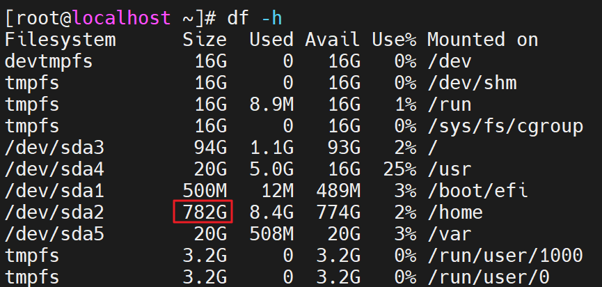

```
# HDD 총량
df -h  // home 디렉터리의 파티션 용량 확인
```

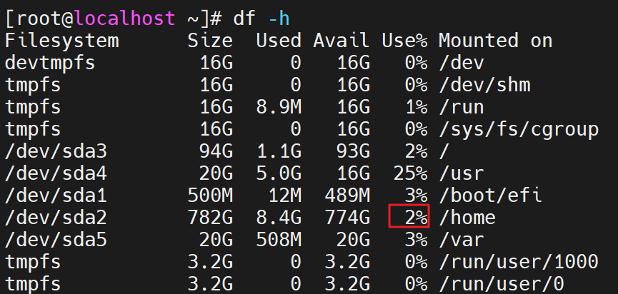

```
# HDD 사용량
df -h  // home 디렉터리의 파티션 사용량 확인
```

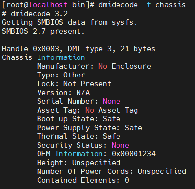

```
# 전원 이중화
dmidecode -t chassis // 1개 기본, 2개부터 커스텀이다.
```

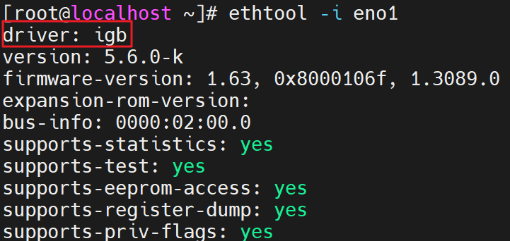

```
# UTP / 광
ethtool -i [NIC name] // driver가 igb,tg3 등 이면 utp이다.
```
---

## 버전 정보


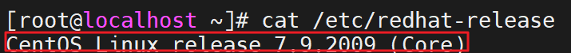

```
# OS_V
cat /etc/redhat-release // CentOS 버전 정보 확인
```


```
# WAS_V
/home/tgate/tools/WAS/apache-tomcat-8.5.87/bin/version.sh // Server number 확인
```

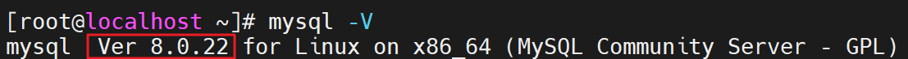

```
# MYSQL_V
mysql -V // mysql.ver 확인
```

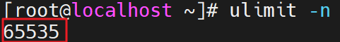

```
# openfile
ulimit -n // 65535면 정상이다. 리눅스의 오픈할 수 있는 최대 갯수
```

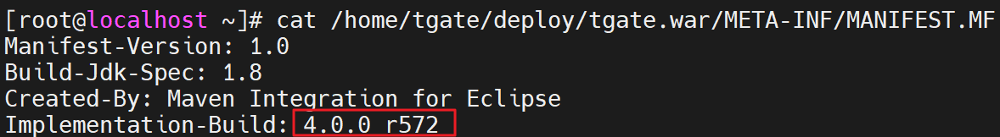

```
# Console
cat /home/tgate/deploy/tgate.war/META-INF/MANIFEST.MF // Implementaion Build 확인
```

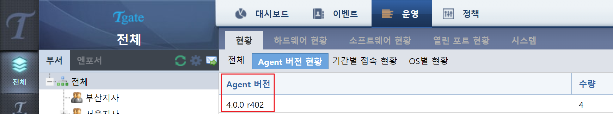

```
# Agent
관리자 페이지 -> 전체 -> 운영 -> Agent 현황
```

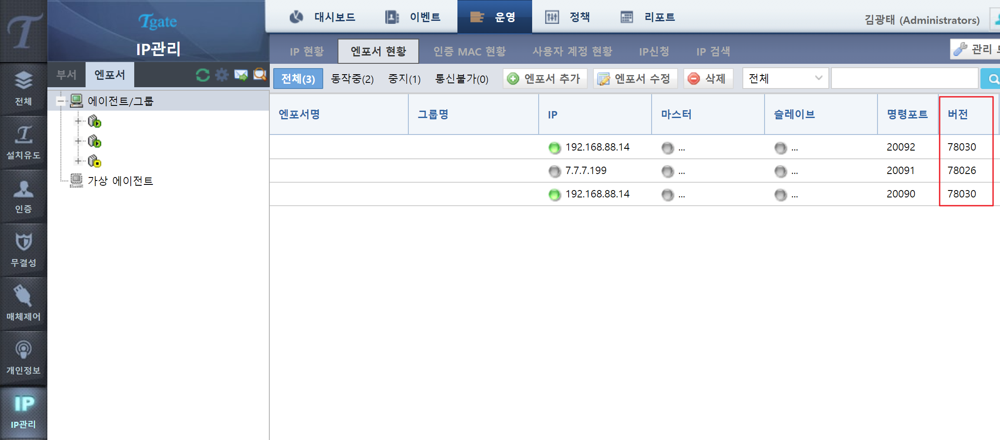

```
# Enforcer
관리자 페이지 -> IP관리 -> 운영 -> 엔포서 현황
```

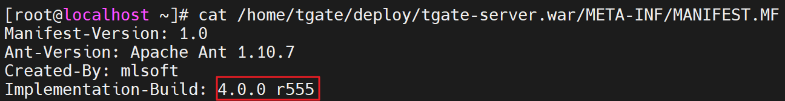

```
# Server
cat /home/tagte/deploy/tgate-server.war/META-INF/MANIFEST.MF // Implementation Build 확인
```

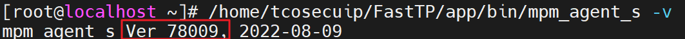

```
# APP
/home/tcosecuip/FastTP/bin/mpm_agent_s -v // mpm_agent_s Ver 확인
```

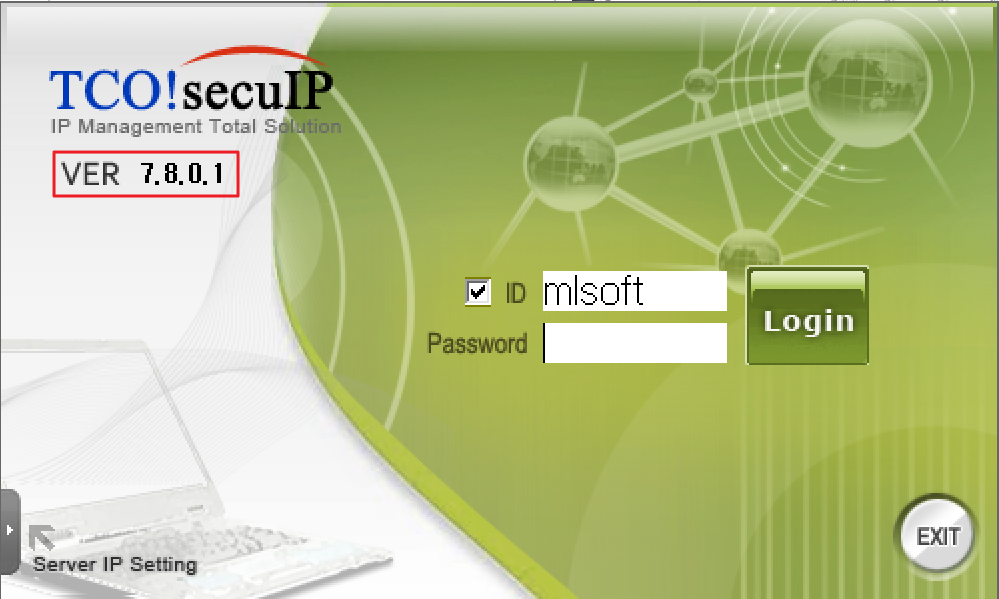

```
# C/S
Ver 확인, C/S 콘솔 사용하지 않으면 공백
```

## SW 정보

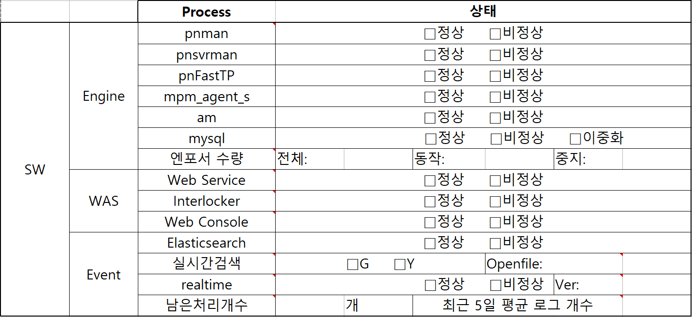


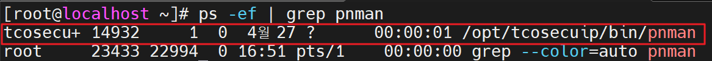

```
# pnman
ps -ef | grep pnman // /opt/tcosecuip/bin/pnman 프로세스가 기동 중이면 정상
```

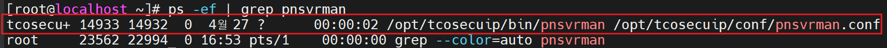

```
# pnsvrman
ps -ef | grep pnsvrman // /opt/tcosecuip/bin/pnsvrman, /opt/tcosecuip/conf/pnsvrman.conf 프로세스가 기동 중이면 정상

```

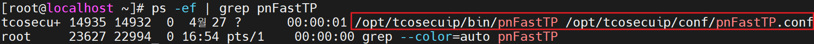

```
# pnFastTP
ps -ef | grep pnFastTP // /opt/tcosecuip/bin/pnFastTP, /opt/tcosecuip/conf/pnFastTP.conf 프로세스가 기동 중이면 정상

```

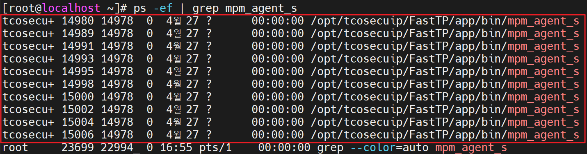

```
# mpm_agent_s
ps -ef | grep mpm_agent_s // /opt/tcosecuip/FastTP/app/bin/mpm_agent_s 프로세스가 10개 기동 중이면 정상

```

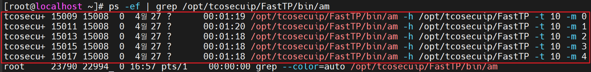

```
# am
ps -ef | grep  // /opt/tcosecuip/FastTP/bin/am -h, /opt/tcosecuip/FastTP -t 10 -m n 프로세스가 5개 기동 중이면 정상
```

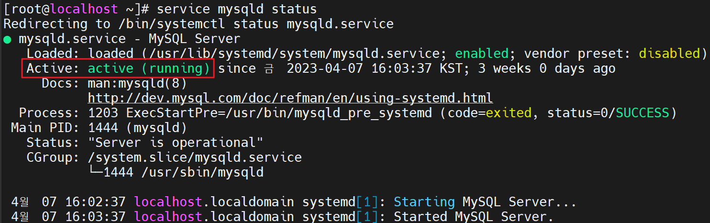
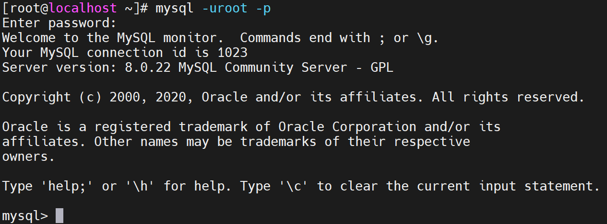

```
# mysql
service mysqld status // active 확인
mysql -u root -p // DB 접속 확인까지 권장

```

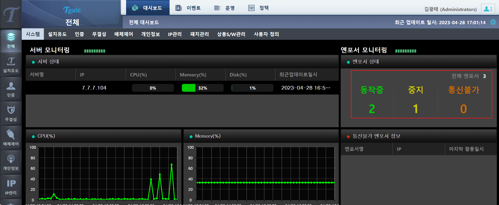

```
# 엔포서 수량
관리자 페이지 -> 대시 보드 // 엔포서 상태 확인
```

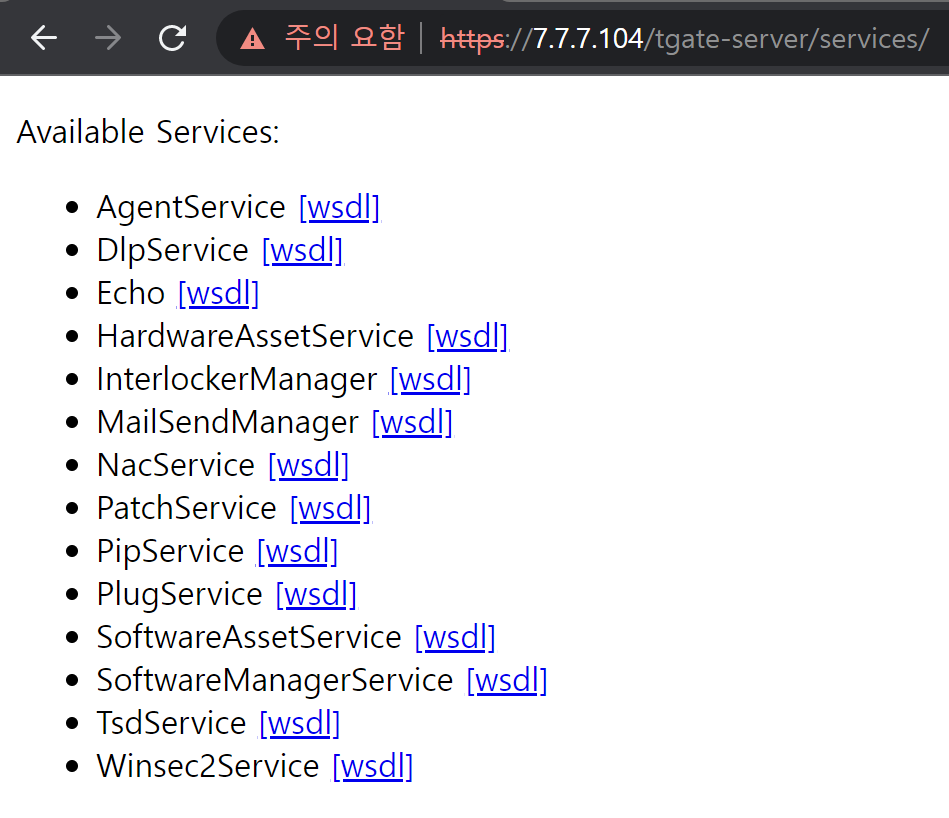


```
# Web Service
웹 브라우저 -> URL -> https://서버IP/tgate-server/services // Available Services: 페이지가 출력되면 정상
```

```
# Interlocker
cat /home/tgate/tools/WAS/apache-tomcat-8.5.81/logs/interlocker.log // 로그에 ERROR 없고 동기화 완료 문구가 있으면 정상이다.
                                                                       인사연동 모듈을 사용하지 않으면 패스.

```

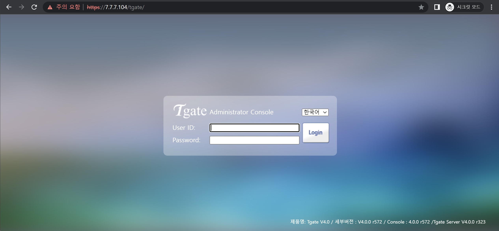

```
# Web Console
웹 브라우저 -> URL -> https://서버IP/tgate
```

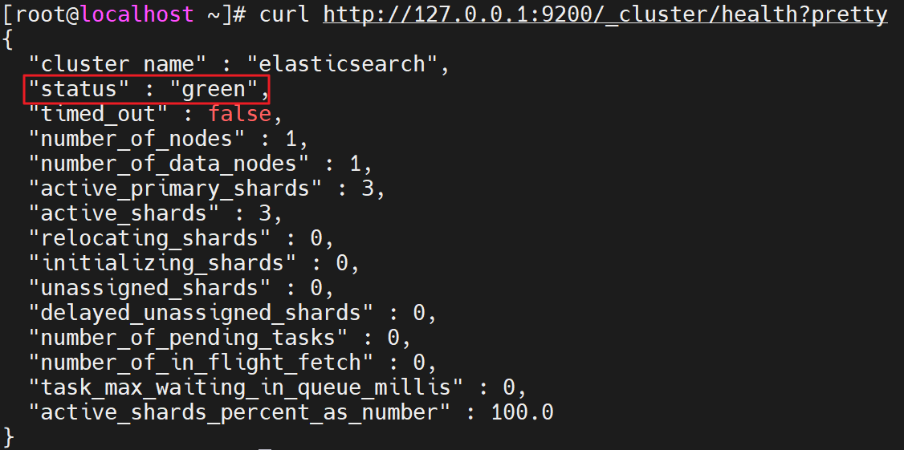

```
# Elastocsearch
curl http://127.0.0.1:9200/_cluster/health?pretty  // status가 green 혹은 yellow면 정상
```


```
# 실시간검색
curl http://127.0.0.1:9200/_cluster/health?pretty // status가 green이면 G, yellow면 Y
```

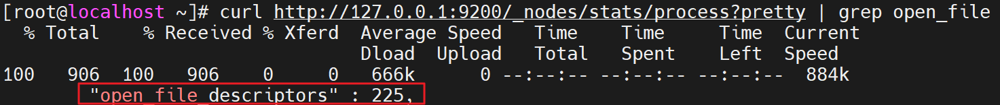

```
# openfile
curl http://127.0.0.1:9200/_nodes/stats/process?pretty | grep open_file // open_file_desciptors 확인
```

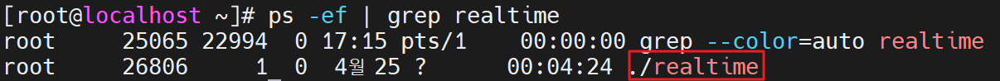

```
# realtime
ps -ef | grep realtime // ./realtime 프로세스가 기동 중이면 정상
```

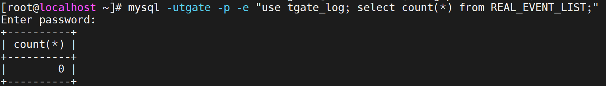

```
# 남은처리개수
mysql -utgate -p -e "use tgate_log; select count(*) from REAL_EVENT_LIST;" // count(*)의 값이 줄어들고 있거나 0이면 정상
```

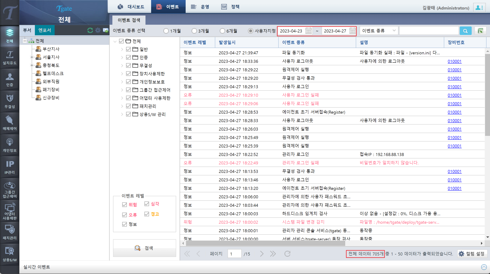

```
# 최근 5일 평균 로그 개수
지난 5일간의 이벤트 검색 후 총량 나누기 5
```

---

## 백업정보


```
# 정책 백업
crontab -l  // /home/tgate/backup/경로, /home/tcosecuip/backup/경로
```

```
# 삭제 주기 DB
crontab -l // DB삭제 주기 확인
```

```
# 삭제 주기 Engine
crontab -l // 서비스 로그 삭제 주기 확인
```
---

## 라이센스


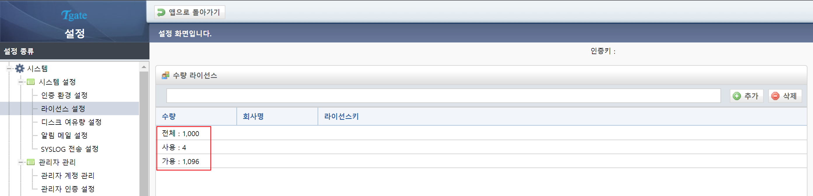

```
# 라이센스 전체
라이센스 수량 전체 확인
```


```
# 라이센스 현재
라이센스 수량 사용 확인
```

---

