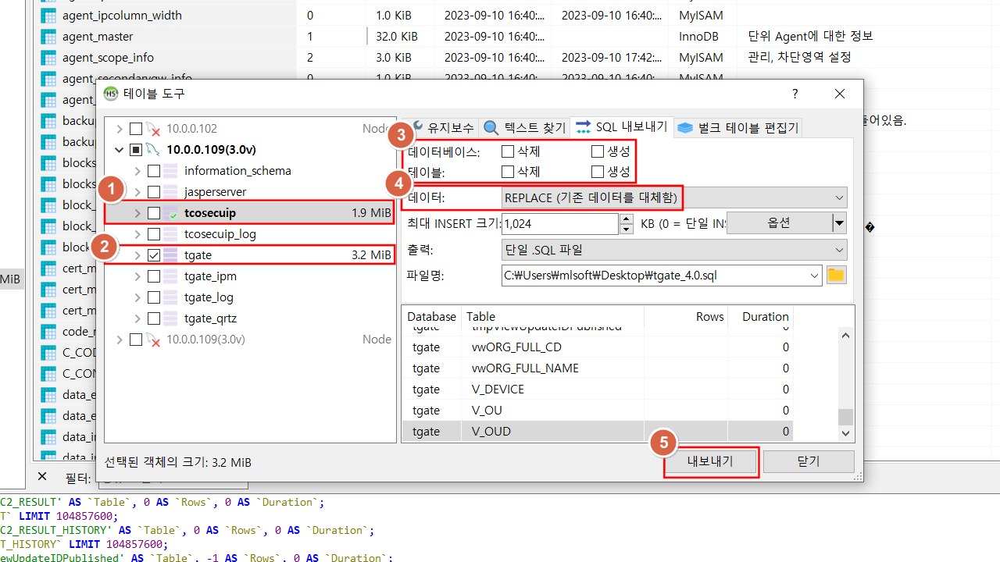

# Tgate + Ttcosecuip 고도화

## 3.0 -> 4.0 (기존 서버 db만 받아서 신규 서버로 올릴때)


### 1. Spec
```
10.0.0.102 -> tgate 4.0
10.0.0.109 -> tgate 3.0
```
---

### 2. 고도화 작업

----

### 2-1. 고객사에서 노트북으로 붙어 작업이 가능한 경우



* 3.0 DB와 4.0 DB를 Heidsql를 이용하여 replace로 생성, 삭제 체크 해제 후 백업한다.

```
1. tcosecuip 백업해야할 db tgate와 따로 백업한다.

2. tgate , tcosecuip 와 따로 백업한다.

3. 데이터베이스와 테이블에 따로 생성과 삭제를 하지않는다.

4. 데이터는 REPLACE 로 백업한다.

5. 파일명과 경로를 확인하여 내보내기 버튼으로 .sql로 저장한다.
```


---


### 2-2. cli 작업으로 진행할 경우


```
[10.0.0.109 (3.0server)]
mysqldump -n -c -t -uroot -p tgate > tgate_3.0.sql
mysqldump -n -c -t -uroot -p tcosecuip > tcosecuip_3.0.sql

[10.0.0.102 (4.0server)]
mysqldump -n -c -t -uroot -p tgate > tgate_4.0.sql
mysqldump -n -c -t -uroot -p tcosecuip > tcosecuip_4.0.sql
```
=> 각 서버의 DB를 tgate, tcosecuip 각각 백업

---

### 3. DB 라이센스 백업

```
* 3.0 Server DB에서 tgate -> C_CONFIG -> CONFIG_CERTIFICATION, CONFIG_LICENSE, CONFIG_LISENCE_AMOUNT 3개 백업

* tcosecuip -> master_info -> license 백업 
```

---

### 4. DB 교체 및 라이센스 추가

```
[10.0.0.102 (4.0 Server)]

#mysql -u root -p root tgate < tgate_3.0.sql
#mysql -u root -p root tcosecuip < tcosecuip_3.0.sql

tgate -> C_CONFIG -> CONFIG_CERTIFICATION, CONFIG_LICENSE, CONFIG_LISENCE_AMOUNT 3개를 3.0 라이센스로 수정

tcosecuip -> master_info -> license 3.0 라이센스로 수정
```

---


### 5. SALT 추가

```
vim /home/tgate/bin/config/env.properties
!
Login.passwdHash.change2salt = 1 // 추가
!

=> 기존 3.0 ver는 sha256까지 였지만 4.0 부터는 SALT 추가를 해줘야 Tgate 4.0 console에 login 할 수 있다.
```

---

### 6. WAS tomcat 재 기동

```
#/home/tgate/bin/shudown.sh
#ps -ef | grep tomcat // 뜨는게 없다면 정상
#/home/tgate/bin/startup.sh
```

---


