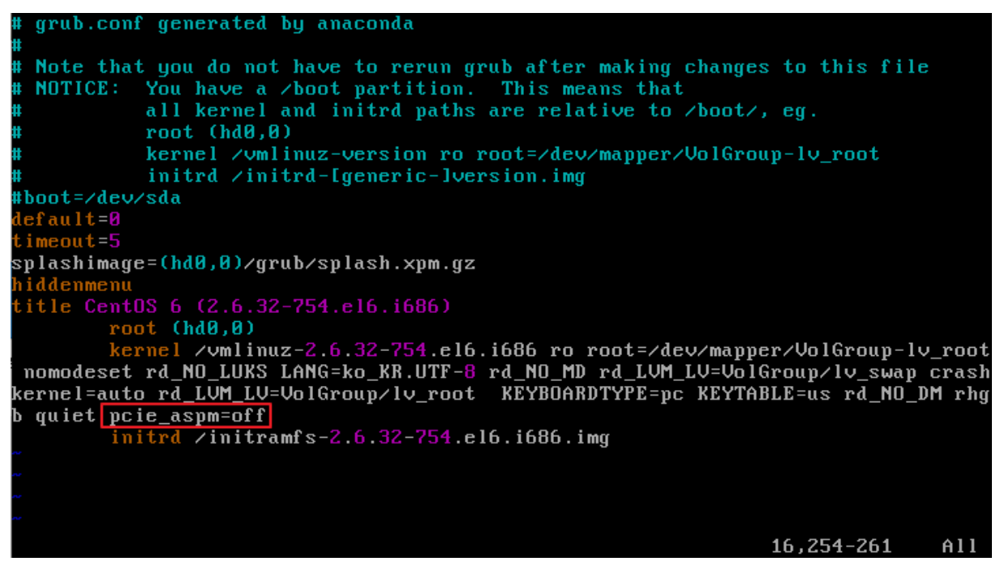

# Centos6 설치 가이드

---

## 방화벽 해제
```
service iptables status
iptables -L
service iptables stop
chkconfig iptables off
service iptables status
iptables -L
```

---

## 셀리눅스 해제 & IP설정

```
vim /etc/selinux/config
!
disabled
!
cd /etc/sysconfig/network-scripts
vim ifcfg-eth0
!
ONBOOT=yes
!
cd /etc/udev/rules.d/
rm 70-persistent-net.rules 
y
service network restart
ifconfig
```

---

## update 
```
yum update -ty
yum install xinetd -y
```

---

## * TN300 (VIP1500) 장비 이더넷 카드가 CentOS6.X와의 드라이버 문제로 장비가 꺼지는 증상 조치



```
vim /boot/grub/grub.conf
!
pcie_aspm=off 
!
reboot
```